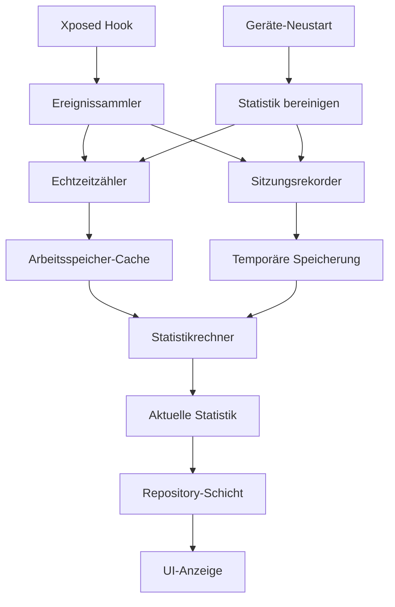

# Zählersystem

Das Zählersystem von NoWakeLock ist für die Echtzeitstatistik der WakeLock-, Alarm- und Service-Aktivitätsdaten der aktuellen Sitzung verantwortlich und stellt dem Benutzer aktuelle Nutzungsinformationen und Leistungsmetriken zur Verfügung. Das System verwendet sitzungsbasierte Statistiken, die nach einem Geräte-Neustart neu beginnen.

## Zählerarchitektur

### Systemübersicht


### Kernkomponenten
```kotlin
// Ereignissammler-Schnittstelle
interface EventCollector {
    fun recordEvent(event: SystemEvent)
    fun getCurrentStats(): CurrentSessionStats
    fun resetStats() // Nach Neustart bereinigen
}

// Zähler-Manager
class CounterManager(
    private val realtimeCounter: RealtimeCounter,
    private val sessionRecorder: SessionRecorder,
    private val statisticsCalculator: StatisticsCalculator
) : EventCollector {
    
    override fun recordEvent(event: SystemEvent) {
        // Echtzeitanzahl
        realtimeCounter.increment(event)
        
        // Sitzungsaufzeichnung (nach Neustart bereinigt)
        sessionRecorder.store(event)
        
        // Statistikaktualisierung auslösen
        if (shouldUpdateStatistics(event)) {
            statisticsCalculator.recalculate(event.packageName)
        }
    }
    
    override fun resetStats() {
        // BootResetManager ruft nach Neustarterkennung auf
        realtimeCounter.clear()
        sessionRecorder.clear()
    }
}
```

## Echtzeitzähler

### RealtimeCounter-Implementierung
```kotlin
class RealtimeCounter {
    
    // Thread-sichere Datenstrukturen verwenden
    private val wakelockCounters = ConcurrentHashMap<String, AtomicCounterData>()
    private val alarmCounters = ConcurrentHashMap<String, AtomicCounterData>()
    private val serviceCounters = ConcurrentHashMap<String, AtomicCounterData>()
    
    // Aktive Zustandsverfolgung
    private val activeWakelocks = ConcurrentHashMap<String, WakelockSession>()
    private val activeServices = ConcurrentHashMap<String, ServiceSession>()
    
    fun increment(event: SystemEvent) {
        when (event.type) {
            EventType.WAKELOCK_ACQUIRE -> handleWakelockAcquire(event)
            EventType.WAKELOCK_RELEASE -> handleWakelockRelease(event)
            EventType.ALARM_TRIGGER -> handleAlarmTrigger(event)
            EventType.SERVICE_START -> handleServiceStart(event)
            EventType.SERVICE_STOP -> handleServiceStop(event)
        }
    }
    
    private fun handleWakelockAcquire(event: SystemEvent) {
        val key = "${event.packageName}:${event.name}"
        
        // Akquisitionszählung erhöhen
        wakelockCounters.computeIfAbsent(key) { 
            AtomicCounterData() 
        }.acquireCount.incrementAndGet()
        
        // Aktiven Status aufzeichnen
        activeWakelocks[event.instanceId] = WakelockSession(
            packageName = event.packageName,
            tag = event.name,
            startTime = event.timestamp,
            flags = event.flags
        )
        
        // App-Level-Statistiken aktualisieren
        updateAppLevelStats(event.packageName, EventType.WAKELOCK_ACQUIRE)
    }
    
    private fun handleWakelockRelease(event: SystemEvent) {
        val session = activeWakelocks.remove(event.instanceId) ?: return
        val key = "${session.packageName}:${session.tag}"
        
        val duration = event.timestamp - session.startTime
        
        wakelockCounters[key]?.let { counter ->
            // Haltezeit aktualisieren
            counter.totalDuration.addAndGet(duration)
            counter.releaseCount.incrementAndGet()
            
            // Maximale Haltezeit aktualisieren
            counter.updateMaxDuration(duration)
        }
        
        // App-Level-Statistiken aktualisieren
        updateAppLevelStats(session.packageName, EventType.WAKELOCK_RELEASE, duration)
    }
    
    private fun handleAlarmTrigger(event: SystemEvent) {
        val key = "${event.packageName}:${event.name}"
        
        alarmCounters.computeIfAbsent(key) {
            AtomicCounterData()
        }.let { counter ->
            counter.triggerCount.incrementAndGet()
            counter.lastTriggerTime.set(event.timestamp)
            
            // Auslösungsintervall berechnen
            val interval = event.timestamp - counter.previousTriggerTime.getAndSet(event.timestamp)
            if (interval > 0) {
                counter.updateTriggerInterval(interval)
            }
        }
        
        updateAppLevelStats(event.packageName, EventType.ALARM_TRIGGER)
    }
}

// Atomare Zählerdaten
class AtomicCounterData {
    // WakeLock-Zähler
    val acquireCount = AtomicLong(0)
    val releaseCount = AtomicLong(0)
    val totalDuration = AtomicLong(0)
    val maxDuration = AtomicLong(0)
    
    // Alarm-Zähler
    val triggerCount = AtomicLong(0)
    val lastTriggerTime = AtomicLong(0)
    val previousTriggerTime = AtomicLong(0)
    val minInterval = AtomicLong(Long.MAX_VALUE)
    val maxInterval = AtomicLong(0)
    val totalInterval = AtomicLong(0)
    
    // Service-Zähler
    val startCount = AtomicLong(0)
    val stopCount = AtomicLong(0)
    val runningDuration = AtomicLong(0)
    
    // Allgemeine Methoden
    fun updateMaxDuration(duration: Long) {
        maxDuration.accumulateAndGet(duration) { current, new -> maxOf(current, new) }
    }
    
    fun updateTriggerInterval(interval: Long) {
        minInterval.accumulateAndGet(interval) { current, new -> minOf(current, new) }
        maxInterval.accumulateAndGet(interval) { current, new -> maxOf(current, new) }
        totalInterval.addAndGet(interval)
    }
    
    fun snapshot(): CounterSnapshot {
        return CounterSnapshot(
            acquireCount = acquireCount.get(),
            releaseCount = releaseCount.get(),
            totalDuration = totalDuration.get(),
            maxDuration = maxDuration.get(),
            triggerCount = triggerCount.get(),
            avgInterval = if (triggerCount.get() > 1) {
                totalInterval.get() / (triggerCount.get() - 1)
            } else 0,
            minInterval = if (minInterval.get() == Long.MAX_VALUE) 0 else minInterval.get(),
            maxInterval = maxInterval.get()
        )
    }
}
```

### Sitzungsverfolgung
```kotlin
// WakeLock-Sitzungsdaten
data class WakelockSession(
    val packageName: String,
    val tag: String,
    val startTime: Long,
    val flags: Int,
    val uid: Int = 0,
    val pid: Int = 0
) {
    val duration: Long get() = System.currentTimeMillis() - startTime
    val isLongRunning: Boolean get() = duration > 60_000 // Über 1 Minute
}

// Service-Sitzungsdaten
data class ServiceSession(
    val packageName: String,
    val serviceName: String,
    val startTime: Long,
    val isForeground: Boolean = false,
    val instanceCount: Int = 1
) {
    val duration: Long get() = System.currentTimeMillis() - startTime
    val isLongRunning: Boolean get() = duration > 300_000 // Über 5 Minuten
}

// Sitzungs-Manager
class SessionManager {
    
    private val activeWakelocks = ConcurrentHashMap<String, WakelockSession>()
    private val activeServices = ConcurrentHashMap<String, ServiceSession>()
    private val sessionHistory = LRUCache<String, List<SessionRecord>>(1000)
    
    fun startWakelockSession(instanceId: String, session: WakelockSession) {
        activeWakelocks[instanceId] = session
        scheduleSessionTimeout(instanceId, session.tag, 300_000) // 5 Minuten Timeout
    }
    
    fun endWakelockSession(instanceId: String): WakelockSession? {
        val session = activeWakelocks.remove(instanceId)
        session?.let {
            recordSessionHistory(it)
            cancelSessionTimeout(instanceId)
        }
        return session
    }
    
    fun getActiveSessions(): SessionSummary {
        return SessionSummary(
            activeWakelocks = activeWakelocks.values.toList(),
            activeServices = activeServices.values.toList(),
            totalActiveTime = calculateTotalActiveTime(),
            longestRunningSession = findLongestRunningSession()
        )
    }
    
    private fun scheduleSessionTimeout(instanceId: String, tag: String, timeout: Long) {
        // Coroutine-Verzögerung für Timeout-Sitzung verwenden
        CoroutineScope(Dispatchers.IO).launch {
            delay(timeout)
            if (activeWakelocks.containsKey(instanceId)) {
                XposedBridge.log("WakeLock timeout: $tag (${timeout}ms)")
                // Timeout-WakeLock forciert freigeben
                forceReleaseWakeLock(instanceId)
            }
        }
    }
}
```

## Sitzungsrekorder

### SessionRecorder-Implementierung
```kotlin
class SessionRecorder(
    private val database: InfoDatabase
) {
    
    private val eventBuffer = ConcurrentLinkedQueue<InfoEvent>()
    private val bufferSize = AtomicInteger(0)
    private val maxBufferSize = 1000
    
    fun store(event: SystemEvent) {
        val infoEvent = event.toInfoEvent()
        
        // Zu Puffer hinzufügen (nur aktuelle Sitzung)
        eventBuffer.offer(infoEvent)
        
        // Prüfen, ob Stapelschreibung erforderlich
        if (bufferSize.incrementAndGet() >= maxBufferSize) {
            flushBuffer()
        }
    }
    
    private fun flushBuffer() {
        val events = mutableListOf<InfoEvent>()
        
        // Ereignisse stapelweise abrufen
        while (events.size < maxBufferSize && !eventBuffer.isEmpty()) {
            eventBuffer.poll()?.let { events.add(it) }
        }
        
        if (events.isNotEmpty()) {
            CoroutineScope(Dispatchers.IO).launch {
                try {
                    // Hinweis: InfoDatabase ruft bei Initialisierung clearAllTables() auf
                    // Nach Neustart werden Daten von BootResetManager bereinigt
                    database.infoEventDao().insertAll(events)
                    bufferSize.addAndGet(-events.size)
                } catch (e: Exception) {
                    XposedBridge.log("Failed to store session events: ${e.message}")
                    // Wieder in Warteschlange für Wiederholung einreihen
                    events.forEach { eventBuffer.offer(it) }
                }
            }
        }
    }
    
    fun getCurrentSessionStats(
        packageName: String?,
        type: EventType?
    ): CurrentSessionStats {
        return runBlocking {
            // Nur aktuelle Sitzungsdaten abfragen (nach Neustart geleert)
            val events = database.infoEventDao().getCurrentSessionEvents(
                packageName = packageName,
                type = type?.toInfoEventType()
            )
            
            calculateCurrentSessionStats(events)
        }
    }
    
    fun clear() {
        // Nach Neustart Daten bereinigen
        eventBuffer.clear()
        bufferSize.set(0)
    }
}

// Neustart-Erkennungs-Manager
class BootResetManager(
    private val database: InfoDatabase,
    private val realtimeCounter: RealtimeCounter
) {
    
    fun checkAndResetAfterBoot(): Boolean {
        val bootTime = SystemClock.elapsedRealtime()
        val lastBootTime = getLastBootTime()
        
        // Neustart erkennen
        val isAfterReboot = bootTime < lastBootTime || lastBootTime == 0L
        
        if (isAfterReboot) {
            // Alle Statistikdaten bereinigen
            resetAllStatistics()
            saveLastBootTime(bootTime)
            XposedBridge.log("Device rebooted, statistics reset")
            return true
        }
        
        return false
    }
    
    private fun resetAllStatistics() {
        // Datenbanktabellen bereinigen (InfoDatabase bereinigt auch bei Initialisierung selbst)
        database.infoEventDao().clearAll()
        database.infoDao().clearAll()
        
        // Arbeitsspeicherzähler bereinigen
        realtimeCounter.clear()
    }
}

// XProvider automatische Bereinigung
class XProvider {
    companion object {
        private var db: InfoDatabase = InfoDatabase.getInstance(context).also { 
            it.clearAllTables() // Bei jeder Initialisierung leeren
        }
    }
}
```

### Warum historische Daten bereinigt werden

**Design-Konzept**:
- **Echtzeitkontrolle benötigt keine historischen Daten** - WakeLock/Alarm-Abfangentscheidungen sind sofortig
- **Statistik zeigt aktuelle Sitzung** - Benutzer interessiert sich für aktuellen Akkuverbrauch
- **Datenakkumulation vermeiden** - Historische WakeLock-Ereignisse haben keinen Wert für das System
- **System sauber halten** - Nach Neustart neu beginnen spiegelt tatsächliche Nutzung besser wider

## Statistikrechner

### StatisticsCalculator-Implementierung
```kotlin
class StatisticsCalculator(
    private val realtimeCounter: RealtimeCounter,
    private val sessionRecorder: SessionRecorder,
    private val database: InfoDatabase
) {
    
    fun calculateCurrentAppStatistics(packageName: String): CurrentAppStatistics {
        val realtimeStats = realtimeCounter.getAppStats(packageName)
        val sessionStats = sessionRecorder.getCurrentSessionStats(packageName, null)
        
        return CurrentAppStatistics(
            packageName = packageName,
            sessionStartTime = getSessionStartTime(),
            wakelockStats = calculateCurrentWakelockStats(packageName),
            alarmStats = calculateCurrentAlarmStats(packageName),
            serviceStats = calculateCurrentServiceStats(packageName),
            currentMetrics = calculateCurrentMetrics(packageName)
        )
    }
    
    private fun calculateCurrentWakelockStats(packageName: String): CurrentWakelockStats {
        val events = runBlocking {
            // Nur aktuelle Sitzungsdaten abfragen (nach Neustart bereits geleert)
            database.infoEventDao().getCurrentSessionWakelockEvents(packageName)
        }
        
        val activeEvents = events.filter { it.endTime == null }
        val completedEvents = events.filter { it.endTime != null }
        
        return CurrentWakelockStats(
            totalAcquires = events.size,
            totalReleases = completedEvents.size,
            currentlyActive = activeEvents.size,
            totalDuration = completedEvents.sumOf { it.duration },
            averageDuration = if (completedEvents.isNotEmpty()) {
                completedEvents.map { it.duration }.average().toLong()
            } else 0,
            maxDuration = completedEvents.maxOfOrNull { it.duration } ?: 0,
            blockedCount = events.count { it.isBlocked },
            blockRate = if (events.isNotEmpty()) {
                events.count { it.isBlocked }.toFloat() / events.size
            } else 0f,
            topTags = calculateTopWakelockTags(events),
            recentActivity = calculateRecentActivity(events)
        )
    }
    
    private fun calculateCurrentAlarmStats(packageName: String): CurrentAlarmStats {
        val events = runBlocking {
            database.infoEventDao().getCurrentSessionAlarmEvents(packageName)
        }
        
        val triggerIntervals = calculateTriggerIntervals(events)
        
        return CurrentAlarmStats(
            totalTriggers = events.size,
            blockedTriggers = events.count { it.isBlocked },
            blockRate = if (events.isNotEmpty()) {
                events.count { it.isBlocked }.toFloat() / events.size
            } else 0f,
            averageInterval = triggerIntervals.average().toLong(),
            recentTriggers = events.takeLast(10), // Letzte 10 Auslösungen
            topTags = calculateTopAlarmTags(events)
        )
    }
    
    private fun calculatePerformanceMetrics(packageName: String, timeRange: TimeRange): PerformanceMetrics {
        val events = runBlocking {
            database.infoEventDao().getEventsByPackage(
                packageName = packageName,
                startTime = timeRange.startTime,
                endTime = timeRange.endTime
            )
        }
        
        return PerformanceMetrics(
            totalEvents = events.size,
            eventsPerHour = calculateEventsPerHour(events, timeRange),
            averageCpuUsage = events.map { it.cpuUsage }.average().toFloat(),
            averageMemoryUsage = events.map { it.memoryUsage }.average().toLong(),
            totalBatteryDrain = events.sumOf { it.batteryDrain.toDouble() }.toFloat(),
            efficiencyRating = calculateOverallEfficiency(events),
            resourceIntensity = calculateResourceIntensity(events),
            backgroundActivityRatio = calculateBackgroundRatio(events)
        )
    }
}

// Statistikdatenklassen (aktuelle Sitzung)
data class CurrentAppStatistics(
    val packageName: String,
    val sessionStartTime: Long, // Aktuelle Sitzungsstartzeit (nach Neustart zurückgesetzt)
    val wakelockStats: CurrentWakelockStats,
    val alarmStats: CurrentAlarmStats,
    val serviceStats: CurrentServiceStats,
    val currentMetrics: CurrentMetrics
)

data class CurrentWakelockStats(
    val totalAcquires: Int,
    val totalReleases: Int,
    val currentlyActive: Int,
    val totalDuration: Long,
    val averageDuration: Long,
    val maxDuration: Long,
    val blockedCount: Int,
    val blockRate: Float,
    val topTags: List<TagCount>,
    val recentActivity: List<RecentEvent> // Aktuelle Aktivität, nicht historischer Trend
)

data class CurrentAlarmStats(
    val totalTriggers: Int,
    val blockedTriggers: Int,
    val blockRate: Float,
    val averageInterval: Long,
    val recentTriggers: List<InfoEvent>, // Kürzliche Auslösungsaufzeichnungen
    val topTags: List<TagCount>
)

data class CurrentServiceStats(
    val totalStarts: Int,
    val currentlyRunning: Int,
    val averageRuntime: Long,
    val blockedStarts: Int,
    val blockRate: Float,
    val topServices: List<ServiceCount>
)

data class CurrentMetrics(
    val totalEvents: Int,
    val eventsPerHour: Double, // Ereignisfrequenz der aktuellen Sitzung
    val sessionDuration: Long, // Sitzungsdauer
    val averageResponseTime: Long, // Durchschnittliche Antwortzeit
    val systemLoad: Float // Systemlastindikator
)

data class RecentEvent(
    val timestamp: Long,
    val name: String,
    val action: String, // acquire/release/block
    val duration: Long?
)

data class TagCount(
    val tag: String,
    val count: Int,
    val percentage: Float
)

data class ServiceCount(
    val serviceName: String,
    val startCount: Int,
    val runningTime: Long
)
```

## Datenbereinigungsmechanismus

### Neustarterkennung und Bereinigung
```kotlin
// Tatsächliche BootResetManager-Implementierung im Code
class BootResetManager(
    private val context: Context,
    private val userPreferencesRepository: UserPreferencesRepository
) {
    
    suspend fun checkAndResetIfNeeded(): Boolean {
        val currentBootTime = SystemClock.elapsedRealtime()
        val lastRecordedTime = userPreferencesRepository.getLastBootTime().first()
        val resetDone = userPreferencesRepository.getResetDone().first()
        
        // Neustart erkennen: aktuelle Laufzeit < letzte aufgezeichnete Zeit
        val isAfterReboot = currentBootTime < lastRecordedTime || lastRecordedTime == 0L
        
        if (isAfterReboot || !resetDone) {
            resetTables() // Datenbanktabellen bereinigen
            userPreferencesRepository.setLastBootTime(currentBootTime)
            userPreferencesRepository.setResetDone(true)
            return true
        }
        return false
    }
    
    private suspend fun resetTables() {
        val db = AppDatabase.getInstance(context)
        // Statistik- und Ereignistabellen leeren
        db.infoDao().clearAll()
        db.infoEventDao().clearAll()
    }
}

// XProvider automatische Bereinigung
class XProvider {
    companion object {
        private var db: InfoDatabase = InfoDatabase.getInstance(context).also { 
            it.clearAllTables() // Bei jeder Initialisierung leeren
        }
    }
}
```

### Warum historische Daten bereinigen

**Design-Konzept**:
- **Echtzeitkontrolle benötigt keine historischen Daten** - WakeLock/Alarm-Abfangentscheidungen sind sofortig
- **Statistik zeigt aktuelle Sitzung** - Benutzer interessiert sich für aktuellen Akkuverbrauch
- **Datenakkumulation vermeiden** - Historische WakeLock-Ereignisse haben keinen Wert für das System
- **System sauber halten** - Nach Neustart neu beginnen spiegelt tatsächliche Nutzung besser wider

## Leistungsoptimierung

### Cache-Strategien
```kotlin
class SessionStatisticsCache {
    
    private val cache = LRUCache<String, CacheEntry>(50) // Cache-Größe reduzieren
    private val cacheExpiry = 60_000L // 1 Minute Ablauf (kurzfristiger Cache)
    
    fun getCurrentAppStatistics(packageName: String): CurrentAppStatistics? {
        val key = "current_${packageName}"
        val entry = cache.get(key)
        
        return if (entry != null && !entry.isExpired()) {
            entry.statistics
        } else {
            null
        }
    }
    
    fun putCurrentAppStatistics(packageName: String, statistics: CurrentAppStatistics) {
        val key = "current_${packageName}"
        cache.put(key, CacheEntry(statistics, System.currentTimeMillis() + cacheExpiry))
    }
    
    fun clearOnReboot() {
        // Nach Neustart alle Caches bereinigen
        cache.evictAll()
    }
    
    private data class CacheEntry(
        val statistics: CurrentAppStatistics,
        val expiryTime: Long
    ) {
        fun isExpired(): Boolean = System.currentTimeMillis() > expiryTime
    }
}

// Leichtgewichtiger Berechnungs-Manager
class LightweightStatsManager(
    private val realtimeCounter: RealtimeCounter,
    private val cache: SessionStatisticsCache
) {
    
    // Nur notwendige Echtzeitdaten berechnen
    fun getQuickStats(packageName: String): QuickStats {
        val cached = cache.getCurrentAppStatistics(packageName)
        if (cached != null) return cached.toQuickStats()
        
        // Leichtgewichtige Berechnung
        val realtime = realtimeCounter.getAppStats(packageName)
        return QuickStats(
            activeWakelocks = realtime.activeWakelocks,
            totalEvents = realtime.totalEvents,
            blockedEvents = realtime.blockedEvents,
            sessionUptime = System.currentTimeMillis() - getSessionStartTime()
        )
    }
}

data class QuickStats(
    val activeWakelocks: Int,
    val totalEvents: Int,
    val blockedEvents: Int,
    val sessionUptime: Long
)
```

!!! info "Zählerdesign-Prinzipien"
    Das Zählersystem von NoWakeLock verwendet ein sitzungsbasiertes Design, das für die Echtzeitkontrollfunktionen des Xposed-Moduls optimiert ist. Der Schwerpunkt liegt auf der Echtzeitanzeige des aktuellen Status, nicht auf langfristiger Datenanalyse.

!!! tip "Warum keine historischen Daten gespeichert werden"
    - **Echtzeitkontrolle benötigt keine historischen Daten**: WakeLock/Alarm-Abfangentscheidungen basieren auf aktuellen Ereignissen und Regeln
    - **Statistik nur für aktuelle Sitzung**: Benutzer interessiert sich für aktuellen Akkuverbrauch und Systemstatus
    - **Datenakkumulation verhindern**: Historische WakeLock-Ereignisse haben keinen praktischen Wert für Systemverwaltung
    - **System leichtgewichtig halten**: Neustart-Datenbereinigung gewährleistet effiziente Modulausführung

!!! warning "Datenlebenszyklus"
    - **Echtzeitzähler**: Im Arbeitsspeicher gespeichert, bei Prozessneustart geleert
    - **Sitzungsrekorder**: Temporäre Datenbankspeicherung, bei Geräte-Neustart geleert
    - **Statistikdaten**: Existiert nur in aktueller Sitzung, wird nicht über Neustarts hinweg gespeichert