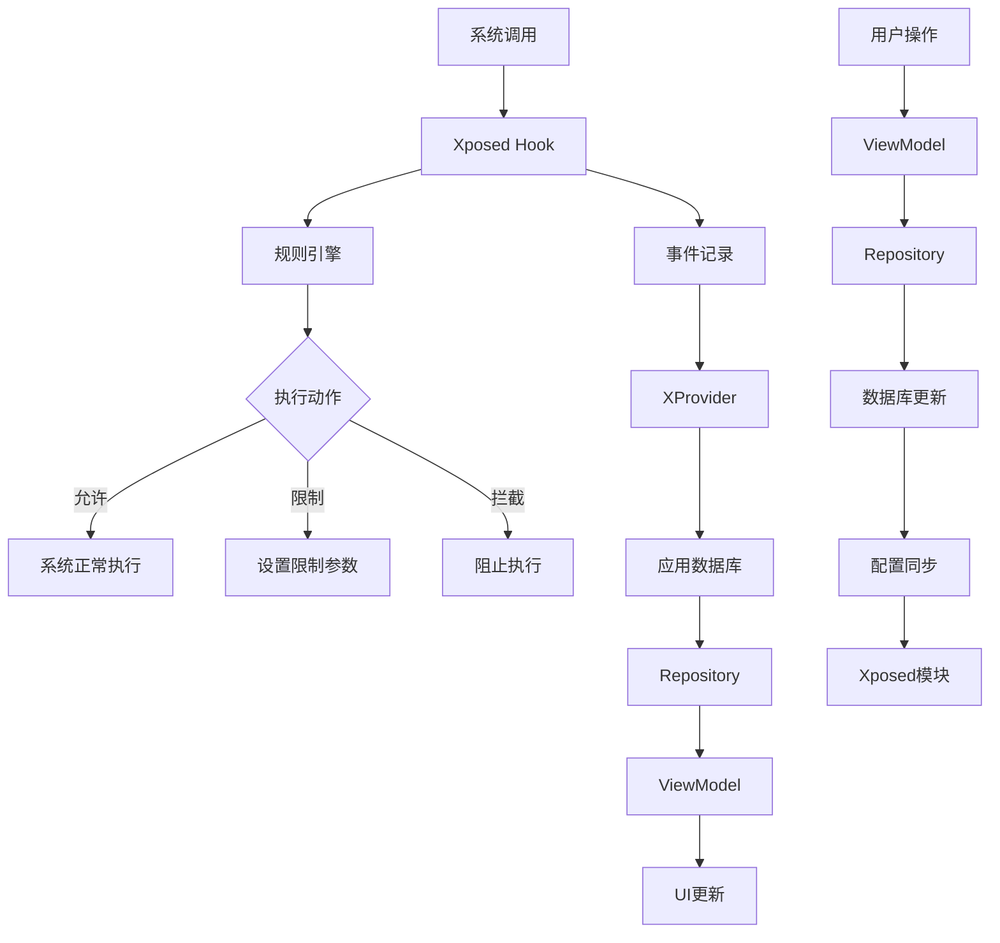

# 数据流设计

NoWakeLock 的数据流设计采用响应式架构，确保系统级事件、用户操作和 UI 更新的高效协调。

## 数据流概览

### 整体数据流图


## 数据层架构

### 双数据库设计
```kotlin
// 主业务数据库 - 应用信息和配置
@Database(
    entities = [
        AppInfo::class,
        WakelockRule::class,
        AlarmRule::class,
        ServiceRule::class
    ],
    version = 13,
    exportSchema = true
)
abstract class AppDatabase : RoomDatabase() {
    abstract fun appInfoDao(): AppInfoDao
    abstract fun wakelockRuleDao(): WakelockRuleDao
    // ...其他 DAO
}

// 事件记录数据库 - 运行时数据
@Database(
    entities = [InfoEvent::class],
    version = 12,
    exportSchema = true
)
abstract class InfoDatabase : RoomDatabase() {
    abstract fun infoEventDao(): InfoEventDao
}
```

### 数据实体设计
```kotlin
// 应用信息实体
@Entity(
    tableName = "appInfo",
    primaryKeys = ["packageName", "userId"],
    indices = [
        Index(value = ["packageName"]),
        Index(value = ["userId"]),
        Index(value = ["system"])
    ]
)
data class AppInfo(
    var packageName: String = "",
    var uid: Int = 0,
    var label: String = "",
    var icon: Int = 0,
    var system: Boolean = false,
    var enabled: Boolean = false,
    var persistent: Boolean = false,
    var processName: String = "",
    var userId: Int = 0,
)

// 事件记录实体
@Entity(
    tableName = "info_event",
    indices = [
        Index(value = ["packageName", "userId"]),
        Index(value = ["type"]),
        Index(value = ["startTime"]),
        Index(value = ["isBlocked"])
    ]
)
data class InfoEvent(
    @PrimaryKey var instanceId: String = "",
    var name: String = "",
    var type: Type = Type.UnKnow,
    var packageName: String = "",
    var userId: Int = 0,
    var startTime: Long = 0,
    var endTime: Long? = null,
    var isBlocked: Boolean = false,
) {
    enum class Type {
        UnKnow, WakeLock, Alarm, Service
    }
}
```

## Repository 数据流

### Repository 接口设计
```kotlin
// DA (Detection Action) Repository - 主要数据仓库
interface DARepository {
    fun getApps(userId: Int): Flow<List<AppDas>>
    fun getWakelocks(userId: Int): Flow<List<WakelockDas>>
    fun getAlarms(userId: Int): Flow<List<AlarmDas>>
    fun getServices(userId: Int): Flow<List<ServiceDas>>
    
    suspend fun updateRule(rule: Rule)
    suspend fun deleteRule(rule: Rule)
    suspend fun syncAppInfo()
}

// 应用详情 Repository
interface AppDetailRepository {
    fun getAppDetail(packageName: String, userId: Int): Flow<AppDetail>
    fun getAppEvents(packageName: String, userId: Int): Flow<List<InfoEvent>>
    suspend fun updateAppConfig(config: AppConfig)
}
```

### Repository 实现
```kotlin
class DARepositoryImpl(
    private val appInfoDao: AppInfoDao,
    private val infoEventDao: InfoEventDao,
    private val wakelockRuleDao: WakelockRuleDao,
    private val xProvider: XProvider
) : DARepository {
    
    override fun getApps(userId: Int): Flow<List<AppDas>> {
        return combine(
            appInfoDao.getAppsByUser(userId),
            infoEventDao.getEventStatsByUser(userId)
        ) { apps, eventStats ->
            apps.map { app ->
                val stats = eventStats[app.packageName] ?: EventStats()
                AppDas(
                    appInfo = app,
                    wakelockCount = stats.wakelockCount,
                    alarmCount = stats.alarmCount,
                    serviceCount = stats.serviceCount,
                    lastActivity = stats.lastActivity
                )
            }
        }.distinctUntilChanged()
    }
    
    override suspend fun updateRule(rule: Rule) {
        when (rule.type) {
            RuleType.WAKELOCK -> wakelockRuleDao.insertOrUpdate(rule.toWakelockRule())
            RuleType.ALARM -> alarmRuleDao.insertOrUpdate(rule.toAlarmRule())
            RuleType.SERVICE -> serviceRuleDao.insertOrUpdate(rule.toServiceRule())
        }
        
        // 同步到 Xposed 模块
        xProvider.syncRule(rule)
    }
}
```

## ViewModel 数据流

### 状态管理模式
```kotlin
// UI 状态定义
data class DAsUiState(
    val apps: List<AppDas> = emptyList(),
    val isLoading: Boolean = false,
    val searchQuery: String = "",
    val filterOption: FilterOption = FilterOption.ALL,
    val sortOption: SortOption = SortOption.NAME,
    val currentUserId: Int = 0,
    val error: String? = null
)

// ViewModel 实现
class DAsViewModel(
    private val repository: DARepository,
    private val userRepository: UserPreferencesRepository
) : ViewModel() {
    
    private val _uiState = MutableStateFlow(DAsUiState())
    val uiState: StateFlow<DAsUiState> = _uiState.asStateFlow()
    
    init {
        loadInitialData()
    }
    
    private fun loadInitialData() {
        viewModelScope.launch {
            combine(
                repository.getApps(uiState.value.currentUserId),
                userRepository.searchQuery,
                userRepository.filterOption,
                userRepository.sortOption
            ) { apps, query, filter, sort ->
                apps.filter { app ->
                    // 应用搜索和过滤逻辑
                    app.matchesQuery(query) && app.matchesFilter(filter)
                }.sortedWith(sort.comparator)
            }.catch { error ->
                _uiState.update { it.copy(error = error.message) }
            }.collect { filteredApps ->
                _uiState.update { 
                    it.copy(
                        apps = filteredApps,
                        isLoading = false
                    ) 
                }
            }
        }
    }
}
```

### 数据更新流程
```kotlin
// 用户操作触发的数据流
fun updateWakelockRule(packageName: String, tag: String, action: ActionType) {
    viewModelScope.launch {
        try {
            val rule = WakelockRule(
                packageName = packageName,
                tag = tag,
                action = action,
                userId = uiState.value.currentUserId
            )
            
            repository.updateRule(rule)
            
            // UI 自动通过 Flow 更新，无需手动刷新
        } catch (e: Exception) {
            _uiState.update { it.copy(error = e.message) }
        }
    }
}
```

## 跨进程通信

### XProvider 数据桥接
```kotlin
class XProvider private constructor() {
    
    companion object {
        private const val AUTHORITY = "com.js.nowakelock.xprovider"
        
        // 事件插入流程
        fun insertEvent(event: InfoEvent) {
            try {
                val data = bundleOf(
                    "instanceId" to event.instanceId,
                    "name" to event.name,
                    "type" to event.type.ordinal,
                    "packageName" to event.packageName,
                    "userId" to event.userId,
                    "startTime" to event.startTime,
                    "isBlocked" to event.isBlocked
                )
                
                // 使用 SystemProperties 进行跨进程通信
                val serialized = serializeBundle(data)
                SystemProperties.set("sys.nowakelock.event", serialized)
                
            } catch (e: Exception) {
                XposedBridge.log("XProvider insertEvent failed: ${e.message}")
            }
        }
        
        // 规则同步流程
        fun syncRule(rule: Rule) {
            try {
                val data = bundleOf(
                    "id" to rule.id,
                    "packageName" to rule.packageName,
                    "target" to rule.target,
                    "action" to rule.action.ordinal,
                    "type" to rule.type.ordinal
                )
                
                val serialized = serializeBundle(data)
                SystemProperties.set("sys.nowakelock.rule.${rule.id}", serialized)
                
            } catch (e: Exception) {
                XposedBridge.log("XProvider syncRule failed: ${e.message}")
            }
        }
    }
}
```

### 数据同步机制
```kotlin
class DataSynchronizer(
    private val appInfoDao: AppInfoDao,
    private val infoEventDao: InfoEventDao
) {
    
    // 定期同步应用信息
    suspend fun syncAppInfo() {
        try {
            val packageManager = context.packageManager
            val installedApps = packageManager.getInstalledApplications(0)
            
            val appInfoList = installedApps.map { appInfo ->
                AppInfo(
                    packageName = appInfo.packageName,
                    uid = appInfo.uid,
                    label = appInfo.loadLabel(packageManager).toString(),
                    system = (appInfo.flags and ApplicationInfo.FLAG_SYSTEM) != 0,
                    enabled = appInfo.enabled,
                    processName = appInfo.processName ?: appInfo.packageName,
                    userId = UserHandle.getUserId(appInfo.uid)
                )
            }
            
            appInfoDao.insertOrUpdateAll(appInfoList)
            
        } catch (e: Exception) {
            Log.e("DataSync", "Failed to sync app info", e)
        }
    }
    
    // 从 Xposed 模块读取事件数据
    suspend fun syncEventData() {
        try {
            // 读取系统属性中的事件数据
            val eventData = SystemProperties.get("sys.nowakelock.events", "")
            if (eventData.isNotEmpty()) {
                val events = deserializeEvents(eventData)
                infoEventDao.insertAll(events)
                
                // 清除已读取的数据
                SystemProperties.set("sys.nowakelock.events", "")
            }
        } catch (e: Exception) {
            Log.e("DataSync", "Failed to sync event data", e)
        }
    }
}
```

## 实时更新机制

### Flow 链式反应
```kotlin
class DataFlowManager {
    
    // 中央数据流协调器
    fun setupDataFlow(): Flow<AppDataUpdate> {
        return merge(
            // 1. 系统事件流
            systemEventFlow(),
            // 2. 用户操作流
            userActionFlow(),
            // 3. 定时同步流
            scheduledSyncFlow()
        ).scan(AppDataUpdate()) { accumulator, update ->
            accumulator.merge(update)
        }.distinctUntilChanged()
    }
    
    private fun systemEventFlow(): Flow<SystemEvent> {
        return callbackFlow {
            val observer = object : ContentObserver(Handler(Looper.getMainLooper())) {
                override fun onChange(selfChange: Boolean, uri: Uri?) {
                    // 监听系统属性变化
                    trySend(SystemEvent.PropertyChanged(uri))
                }
            }
            
            // 注册监听器
            context.contentResolver.registerContentObserver(
                Settings.Global.CONTENT_URI,
                true,
                observer
            )
            
            awaitClose {
                context.contentResolver.unregisterContentObserver(observer)
            }
        }
    }
}
```

### 数据去重和性能优化
```kotlin
// 数据去重策略
fun <T> Flow<List<T>>.distinctItems(): Flow<List<T>> {
    return distinctUntilChanged { old, new ->
        old.size == new.size && old.zip(new).all { (a, b) -> a == b }
    }
}

// 批量更新优化
class BatchUpdateManager {
    
    private val pendingUpdates = mutableListOf<DataUpdate>()
    private val updateJob = Job()
    
    fun scheduleUpdate(update: DataUpdate) {
        synchronized(pendingUpdates) {
            pendingUpdates.add(update)
        }
        
        // 延迟批量执行
        CoroutineScope(updateJob).launch {
            delay(100) // 100ms 批量窗口
            executeBatchUpdate()
        }
    }
    
    private suspend fun executeBatchUpdate() {
        val updates = synchronized(pendingUpdates) {
            val copy = pendingUpdates.toList()
            pendingUpdates.clear()
            copy
        }
        
        if (updates.isNotEmpty()) {
            // 合并并执行更新
            val mergedUpdate = updates.reduce { acc, update -> acc.merge(update) }
            executeUpdate(mergedUpdate)
        }
    }
}
```

## 错误处理和恢复

### 数据流错误处理
```kotlin
// Repository 层错误处理
override fun getApps(userId: Int): Flow<List<AppDas>> {
    return flow {
        emit(getAppsFromDatabase(userId))
    }.catch { exception ->
        when (exception) {
            is SQLiteException -> {
                Log.e("DARepository", "Database error", exception)
                emit(emptyList()) // 返回空列表作为降级处理
            }
            is SecurityException -> {
                Log.e("DARepository", "Permission denied", exception)
                emit(getCachedApps(userId)) // 使用缓存数据
            }
            else -> {
                Log.e("DARepository", "Unexpected error", exception)
                throw exception // 重新抛出未知错误
            }
        }
    }.retry(3) { exception ->
        exception is IOException || exception is SQLiteException
    }
}

// ViewModel 层错误处理
private fun handleError(error: Throwable) {
    val errorMessage = when (error) {
        is NetworkException -> "网络连接失败，请检查网络设置"
        is DatabaseException -> "数据加载失败，请重试"
        is PermissionException -> "权限不足，请检查应用权限"
        else -> "未知错误：${error.message}"
    }
    
    _uiState.update { 
        it.copy(
            error = errorMessage,
            isLoading = false
        ) 
    }
}
```

### 数据一致性保障
```kotlin
class DataConsistencyManager {
    
    // 数据校验
    suspend fun validateDataConsistency() {
        val inconsistencies = mutableListOf<DataInconsistency>()
        
        // 1. 检查孤立事件
        val orphanEvents = infoEventDao.getOrphanEvents()
        if (orphanEvents.isNotEmpty()) {
            inconsistencies.add(DataInconsistency.OrphanEvents(orphanEvents))
        }
        
        // 2. 检查重复规则
        val duplicateRules = ruleDao.getDuplicateRules()
        if (duplicateRules.isNotEmpty()) {
            inconsistencies.add(DataInconsistency.DuplicateRules(duplicateRules))
        }
        
        // 3. 修复数据不一致
        inconsistencies.forEach { inconsistency ->
            fixInconsistency(inconsistency)
        }
    }
    
    private suspend fun fixInconsistency(inconsistency: DataInconsistency) {
        when (inconsistency) {
            is DataInconsistency.OrphanEvents -> {
                // 删除孤立事件或创建默认应用信息
                infoEventDao.deleteOrphanEvents()
            }
            is DataInconsistency.DuplicateRules -> {
                // 合并重复规则
                mergeDuplicateRules(inconsistency.rules)
            }
        }
    }
}
```

## 性能监控

### 数据流性能指标
```kotlin
class DataFlowMetrics {
    
    fun trackFlowPerformance() {
        repository.getApps(userId)
            .onStart { startTime = System.currentTimeMillis() }
            .onEach { apps ->
                val duration = System.currentTimeMillis() - startTime
                Log.d("Performance", "Apps loaded in ${duration}ms, count: ${apps.size}")
                
                if (duration > 1000) {
                    Log.w("Performance", "Slow data loading detected")
                }
            }
            .catch { exception ->
                Log.e("Performance", "Data flow error", exception)
            }
            .flowOn(Dispatchers.IO)
            .collect()
    }
}
```

!!! info "数据流特点"
    NoWakeLock 的数据流设计充分利用了 Kotlin Flow 的响应式特性，确保了数据的实时性和一致性。

!!! tip "性能优化"
    使用 `distinctUntilChanged()` 和批量更新机制可以显著减少不必要的 UI 更新，提升应用性能。