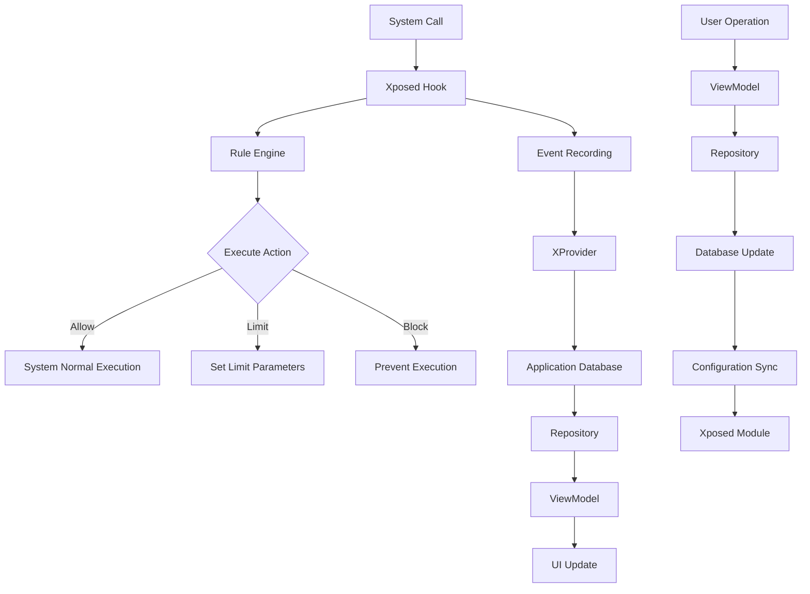

# Data Flow Design

NoWakeLock's data flow design adopts a reactive architecture, ensuring efficient coordination between system-level events, user operations, and UI updates.

## Data Flow Overview

### Overall Data Flow Diagram


## Data Layer Architecture

### Dual Database Design
```kotlin
// Main business database - app info and configuration
@Database(
    entities = [
        AppInfo::class,
        WakelockRule::class,
        AlarmRule::class,
        ServiceRule::class
    ],
    version = 13,
    exportSchema = true
)
abstract class AppDatabase : RoomDatabase() {
    abstract fun appInfoDao(): AppInfoDao
    abstract fun wakelockRuleDao(): WakelockRuleDao
    // ...other DAOs
}

// Event recording database - runtime data
@Database(
    entities = [InfoEvent::class],
    version = 12,
    exportSchema = true
)
abstract class InfoDatabase : RoomDatabase() {
    abstract fun infoEventDao(): InfoEventDao
}
```

### Data Entity Design
```kotlin
// Application info entity
@Entity(
    tableName = "appInfo",
    primaryKeys = ["packageName", "userId"],
    indices = [
        Index(value = ["packageName"]),
        Index(value = ["userId"]),
        Index(value = ["system"])
    ]
)
data class AppInfo(
    var packageName: String = "",
    var uid: Int = 0,
    var label: String = "",
    var icon: Int = 0,
    var system: Boolean = false,
    var enabled: Boolean = false,
    var persistent: Boolean = false,
    var processName: String = "",
    var userId: Int = 0,
)

// Event recording entity
@Entity(
    tableName = "info_event",
    indices = [
        Index(value = ["packageName", "userId"]),
        Index(value = ["type"]),
        Index(value = ["startTime"]),
        Index(value = ["isBlocked"])
    ]
)
data class InfoEvent(
    @PrimaryKey var instanceId: String = "",
    var name: String = "",
    var type: Type = Type.UnKnow,
    var packageName: String = "",
    var userId: Int = 0,
    var startTime: Long = 0,
    var endTime: Long? = null,
    var isBlocked: Boolean = false,
) {
    enum class Type {
        UnKnow, WakeLock, Alarm, Service
    }
}
```

## Repository Data Flow

### Repository Interface Design
```kotlin
// DA (Detection Action) Repository - main data repository
interface DARepository {
    fun getApps(userId: Int): Flow<List<AppDas>>
    fun getWakelocks(userId: Int): Flow<List<WakelockDas>>
    fun getAlarms(userId: Int): Flow<List<AlarmDas>>
    fun getServices(userId: Int): Flow<List<ServiceDas>>
    
    suspend fun updateRule(rule: Rule)
    suspend fun deleteRule(rule: Rule)
    suspend fun syncAppInfo()
}

// App detail repository
interface AppDetailRepository {
    fun getAppDetail(packageName: String, userId: Int): Flow<AppDetail>
    fun getAppEvents(packageName: String, userId: Int): Flow<List<InfoEvent>>
    suspend fun updateAppConfig(config: AppConfig)
}
```

### Repository Implementation
```kotlin
class DARepositoryImpl(
    private val appInfoDao: AppInfoDao,
    private val infoEventDao: InfoEventDao,
    private val wakelockRuleDao: WakelockRuleDao,
    private val xProvider: XProvider
) : DARepository {
    
    override fun getApps(userId: Int): Flow<List<AppDas>> {
        return combine(
            appInfoDao.getAppsByUser(userId),
            infoEventDao.getEventStatsByUser(userId)
        ) { apps, eventStats ->
            apps.map { app ->
                val stats = eventStats[app.packageName] ?: EventStats()
                AppDas(
                    appInfo = app,
                    wakelockCount = stats.wakelockCount,
                    alarmCount = stats.alarmCount,
                    serviceCount = stats.serviceCount,
                    lastActivity = stats.lastActivity
                )
            }
        }.distinctUntilChanged()
    }
    
    override suspend fun updateRule(rule: Rule) {
        when (rule.type) {
            RuleType.WAKELOCK -> wakelockRuleDao.insertOrUpdate(rule.toWakelockRule())
            RuleType.ALARM -> alarmRuleDao.insertOrUpdate(rule.toAlarmRule())
            RuleType.SERVICE -> serviceRuleDao.insertOrUpdate(rule.toServiceRule())
        }
        
        // Sync to Xposed module
        xProvider.syncRule(rule)
    }
}
```

## ViewModel Data Flow

### State Management Pattern
```kotlin
// UI state definition
data class DAsUiState(
    val apps: List<AppDas> = emptyList(),
    val isLoading: Boolean = false,
    val searchQuery: String = "",
    val filterOption: FilterOption = FilterOption.ALL,
    val sortOption: SortOption = SortOption.NAME,
    val currentUserId: Int = 0,
    val error: String? = null
)

// ViewModel implementation
class DAsViewModel(
    private val repository: DARepository,
    private val userRepository: UserPreferencesRepository
) : ViewModel() {
    
    private val _uiState = MutableStateFlow(DAsUiState())
    val uiState: StateFlow<DAsUiState> = _uiState.asStateFlow()
    
    init {
        loadInitialData()
    }
    
    private fun loadInitialData() {
        viewModelScope.launch {
            combine(
                repository.getApps(uiState.value.currentUserId),
                userRepository.searchQuery,
                userRepository.filterOption,
                userRepository.sortOption
            ) { apps, query, filter, sort ->
                apps.filter { app ->
                    // App search and filter logic
                    app.matchesQuery(query) && app.matchesFilter(filter)
                }.sortedWith(sort.comparator)
            }.catch { error ->
                _uiState.update { it.copy(error = error.message) }
            }.collect { filteredApps ->
                _uiState.update { 
                    it.copy(
                        apps = filteredApps,
                        isLoading = false
                    ) 
                }
            }
        }
    }
}
```

### Data Update Process
```kotlin
// Data flow triggered by user actions
fun updateWakelockRule(packageName: String, tag: String, action: ActionType) {
    viewModelScope.launch {
        try {
            val rule = WakelockRule(
                packageName = packageName,
                tag = tag,
                action = action,
                userId = uiState.value.currentUserId
            )
            
            repository.updateRule(rule)
            
            // UI automatically updates through Flow, no manual refresh needed
        } catch (e: Exception) {
            _uiState.update { it.copy(error = e.message) }
        }
    }
}
```

## Cross-Process Communication

### XProvider Data Bridging
```kotlin
class XProvider private constructor() {
    
    companion object {
        private const val AUTHORITY = "com.js.nowakelock.xprovider"
        
        // Event insertion process
        fun insertEvent(event: InfoEvent) {
            try {
                val data = bundleOf(
                    "instanceId" to event.instanceId,
                    "name" to event.name,
                    "type" to event.type.ordinal,
                    "packageName" to event.packageName,
                    "userId" to event.userId,
                    "startTime" to event.startTime,
                    "isBlocked" to event.isBlocked
                )
                
                // Use SystemProperties for cross-process communication
                val serialized = serializeBundle(data)
                SystemProperties.set("sys.nowakelock.event", serialized)
                
            } catch (e: Exception) {
                XposedBridge.log("XProvider insertEvent failed: ${e.message}")
            }
        }
        
        // Rule synchronization process
        fun syncRule(rule: Rule) {
            try {
                val data = bundleOf(
                    "id" to rule.id,
                    "packageName" to rule.packageName,
                    "target" to rule.target,
                    "action" to rule.action.ordinal,
                    "type" to rule.type.ordinal
                )
                
                val serialized = serializeBundle(data)
                SystemProperties.set("sys.nowakelock.rule.${rule.id}", serialized)
                
            } catch (e: Exception) {
                XposedBridge.log("XProvider syncRule failed: ${e.message}")
            }
        }
    }
}
```

### Data Synchronization Mechanism
```kotlin
class DataSynchronizer(
    private val appInfoDao: AppInfoDao,
    private val infoEventDao: InfoEventDao
) {
    
    // Periodic app info synchronization
    suspend fun syncAppInfo() {
        try {
            val packageManager = context.packageManager
            val installedApps = packageManager.getInstalledApplications(0)
            
            val appInfoList = installedApps.map { appInfo ->
                AppInfo(
                    packageName = appInfo.packageName,
                    uid = appInfo.uid,
                    label = appInfo.loadLabel(packageManager).toString(),
                    system = (appInfo.flags and ApplicationInfo.FLAG_SYSTEM) != 0,
                    enabled = appInfo.enabled,
                    processName = appInfo.processName ?: appInfo.packageName,
                    userId = UserHandle.getUserId(appInfo.uid)
                )
            }
            
            appInfoDao.insertOrUpdateAll(appInfoList)
            
        } catch (e: Exception) {
            Log.e("DataSync", "Failed to sync app info", e)
        }
    }
    
    // Read event data from Xposed module
    suspend fun syncEventData() {
        try {
            // Read event data from system properties
            val eventData = SystemProperties.get("sys.nowakelock.events", "")
            if (eventData.isNotEmpty()) {
                val events = deserializeEvents(eventData)
                infoEventDao.insertAll(events)
                
                // Clear read data
                SystemProperties.set("sys.nowakelock.events", "")
            }
        } catch (e: Exception) {
            Log.e("DataSync", "Failed to sync event data", e)
        }
    }
}
```

## Real-time Update Mechanism

### Flow Chain Reactions
```kotlin
class DataFlowManager {
    
    // Central data flow coordinator
    fun setupDataFlow(): Flow<AppDataUpdate> {
        return merge(
            // 1. System event flow
            systemEventFlow(),
            // 2. User action flow
            userActionFlow(),
            // 3. Scheduled sync flow
            scheduledSyncFlow()
        ).scan(AppDataUpdate()) { accumulator, update ->
            accumulator.merge(update)
        }.distinctUntilChanged()
    }
    
    private fun systemEventFlow(): Flow<SystemEvent> {
        return callbackFlow {
            val observer = object : ContentObserver(Handler(Looper.getMainLooper())) {
                override fun onChange(selfChange: Boolean, uri: Uri?) {
                    // Monitor system property changes
                    trySend(SystemEvent.PropertyChanged(uri))
                }
            }
            
            // Register listener
            context.contentResolver.registerContentObserver(
                Settings.Global.CONTENT_URI,
                true,
                observer
            )
            
            awaitClose {
                context.contentResolver.unregisterContentObserver(observer)
            }
        }
    }
}
```

### Data Deduplication and Performance Optimization
```kotlin
// Data deduplication strategy
fun <T> Flow<List<T>>.distinctItems(): Flow<List<T>> {
    return distinctUntilChanged { old, new ->
        old.size == new.size && old.zip(new).all { (a, b) -> a == b }
    }
}

// Batch update optimization
class BatchUpdateManager {
    
    private val pendingUpdates = mutableListOf<DataUpdate>()
    private val updateJob = Job()
    
    fun scheduleUpdate(update: DataUpdate) {
        synchronized(pendingUpdates) {
            pendingUpdates.add(update)
        }
        
        // Delayed batch execution
        CoroutineScope(updateJob).launch {
            delay(100) // 100ms batch window
            executeBatchUpdate()
        }
    }
    
    private suspend fun executeBatchUpdate() {
        val updates = synchronized(pendingUpdates) {
            val copy = pendingUpdates.toList()
            pendingUpdates.clear()
            copy
        }
        
        if (updates.isNotEmpty()) {
            // Merge and execute updates
            val mergedUpdate = updates.reduce { acc, update -> acc.merge(update) }
            executeUpdate(mergedUpdate)
        }
    }
}
```

## Error Handling and Recovery

### Data Flow Error Handling
```kotlin
// Repository layer error handling
override fun getApps(userId: Int): Flow<List<AppDas>> {
    return flow {
        emit(getAppsFromDatabase(userId))
    }.catch { exception ->
        when (exception) {
            is SQLiteException -> {
                Log.e("DARepository", "Database error", exception)
                emit(emptyList()) // Return empty list as fallback
            }
            is SecurityException -> {
                Log.e("DARepository", "Permission denied", exception)
                emit(getCachedApps(userId)) // Use cached data
            }
            else -> {
                Log.e("DARepository", "Unexpected error", exception)
                throw exception // Re-throw unknown errors
            }
        }
    }.retry(3) { exception ->
        exception is IOException || exception is SQLiteException
    }
}

// ViewModel layer error handling
private fun handleError(error: Throwable) {
    val errorMessage = when (error) {
        is NetworkException -> "Network connection failed, please check network settings"
        is DatabaseException -> "Data loading failed, please retry"
        is PermissionException -> "Insufficient permissions, please check app permissions"
        else -> "Unknown error: ${error.message}"
    }
    
    _uiState.update { 
        it.copy(
            error = errorMessage,
            isLoading = false
        ) 
    }
}
```

### Data Consistency Guarantees
```kotlin
class DataConsistencyManager {
    
    // Data validation
    suspend fun validateDataConsistency() {
        val inconsistencies = mutableListOf<DataInconsistency>()
        
        // 1. Check orphan events
        val orphanEvents = infoEventDao.getOrphanEvents()
        if (orphanEvents.isNotEmpty()) {
            inconsistencies.add(DataInconsistency.OrphanEvents(orphanEvents))
        }
        
        // 2. Check duplicate rules
        val duplicateRules = ruleDao.getDuplicateRules()
        if (duplicateRules.isNotEmpty()) {
            inconsistencies.add(DataInconsistency.DuplicateRules(duplicateRules))
        }
        
        // 3. Fix data inconsistencies
        inconsistencies.forEach { inconsistency ->
            fixInconsistency(inconsistency)
        }
    }
    
    private suspend fun fixInconsistency(inconsistency: DataInconsistency) {
        when (inconsistency) {
            is DataInconsistency.OrphanEvents -> {
                // Delete orphan events or create default app info
                infoEventDao.deleteOrphanEvents()
            }
            is DataInconsistency.DuplicateRules -> {
                // Merge duplicate rules
                mergeDuplicateRules(inconsistency.rules)
            }
        }
    }
}
```

## Performance Monitoring

### Data Flow Performance Metrics
```kotlin
class DataFlowMetrics {
    
    fun trackFlowPerformance() {
        repository.getApps(userId)
            .onStart { startTime = System.currentTimeMillis() }
            .onEach { apps ->
                val duration = System.currentTimeMillis() - startTime
                Log.d("Performance", "Apps loaded in ${duration}ms, count: ${apps.size}")
                
                if (duration > 1000) {
                    Log.w("Performance", "Slow data loading detected")
                }
            }
            .catch { exception ->
                Log.e("Performance", "Data flow error", exception)
            }
            .flowOn(Dispatchers.IO)
            .collect()
    }
}
```

!!! info "Data Flow Characteristics"
    NoWakeLock's data flow design fully utilizes Kotlin Flow's reactive characteristics, ensuring real-time data updates and consistency.

!!! tip "Performance Optimization"
    Using `distinctUntilChanged()` and batch update mechanisms can significantly reduce unnecessary UI updates and improve application performance.