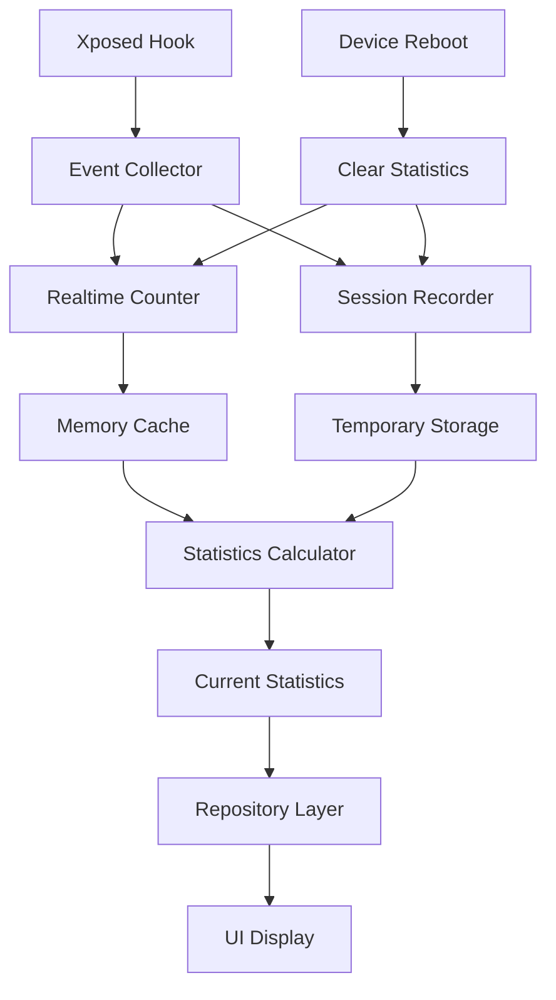

# Counter System

NoWakeLock's counter system is responsible for real-time statistics of current session WakeLock, Alarm, and Service activity data, providing users with current usage status and performance metrics. The system uses session-level statistics that restart counting after device reboot.

## Counter Architecture

### System Overview


### Core Components
```kotlin
// Event collector interface
interface EventCollector {
    fun recordEvent(event: SystemEvent)
    fun getCurrentStats(): CurrentSessionStats
    fun resetStats() // Clear after reboot
}

// Counter manager
class CounterManager(
    private val realtimeCounter: RealtimeCounter,
    private val sessionRecorder: SessionRecorder,
    private val statisticsCalculator: StatisticsCalculator
) : EventCollector {
    
    override fun recordEvent(event: SystemEvent) {
        // Realtime counting
        realtimeCounter.increment(event)
        
        // Session recording (cleared after reboot)
        sessionRecorder.store(event)
        
        // Trigger statistics update
        if (shouldUpdateStatistics(event)) {
            statisticsCalculator.recalculate(event.packageName)
        }
    }
    
    override fun resetStats() {
        // Called by BootResetManager after detecting reboot
        realtimeCounter.clear()
        sessionRecorder.clear()
    }
}
```

## Realtime Counter

### RealtimeCounter Implementation
```kotlin
class RealtimeCounter {
    
    // Use thread-safe data structures
    private val wakelockCounters = ConcurrentHashMap<String, AtomicCounterData>()
    private val alarmCounters = ConcurrentHashMap<String, AtomicCounterData>()
    private val serviceCounters = ConcurrentHashMap<String, AtomicCounterData>()
    
    // Active state tracking
    private val activeWakelocks = ConcurrentHashMap<String, WakelockSession>()
    private val activeServices = ConcurrentHashMap<String, ServiceSession>()
    
    fun increment(event: SystemEvent) {
        when (event.type) {
            EventType.WAKELOCK_ACQUIRE -> handleWakelockAcquire(event)
            EventType.WAKELOCK_RELEASE -> handleWakelockRelease(event)
            EventType.ALARM_TRIGGER -> handleAlarmTrigger(event)
            EventType.SERVICE_START -> handleServiceStart(event)
            EventType.SERVICE_STOP -> handleServiceStop(event)
        }
    }
    
    private fun handleWakelockAcquire(event: SystemEvent) {
        val key = "${event.packageName}:${event.name}"
        
        // Increment acquire count
        wakelockCounters.computeIfAbsent(key) { 
            AtomicCounterData() 
        }.acquireCount.incrementAndGet()
        
        // Record active state
        activeWakelocks[event.instanceId] = WakelockSession(
            packageName = event.packageName,
            tag = event.name,
            startTime = event.timestamp,
            flags = event.flags
        )
        
        // Update app-level statistics
        updateAppLevelStats(event.packageName, EventType.WAKELOCK_ACQUIRE)
    }
    
    private fun handleWakelockRelease(event: SystemEvent) {
        val session = activeWakelocks.remove(event.instanceId) ?: return
        val key = "${session.packageName}:${session.tag}"
        
        val duration = event.timestamp - session.startTime
        
        wakelockCounters[key]?.let { counter ->
            // Update hold duration
            counter.totalDuration.addAndGet(duration)
            counter.releaseCount.incrementAndGet()
            
            // Update maximum hold duration
            counter.updateMaxDuration(duration)
        }
        
        // Update app-level statistics
        updateAppLevelStats(session.packageName, EventType.WAKELOCK_RELEASE, duration)
    }
    
    private fun handleAlarmTrigger(event: SystemEvent) {
        val key = "${event.packageName}:${event.name}"
        
        alarmCounters.computeIfAbsent(key) {
            AtomicCounterData()
        }.let { counter ->
            counter.triggerCount.incrementAndGet()
            counter.lastTriggerTime.set(event.timestamp)
            
            // Calculate trigger interval
            val interval = event.timestamp - counter.previousTriggerTime.getAndSet(event.timestamp)
            if (interval > 0) {
                counter.updateTriggerInterval(interval)
            }
        }
        
        updateAppLevelStats(event.packageName, EventType.ALARM_TRIGGER)
    }
}

// Atomic counter data
class AtomicCounterData {
    // WakeLock counters
    val acquireCount = AtomicLong(0)
    val releaseCount = AtomicLong(0)
    val totalDuration = AtomicLong(0)
    val maxDuration = AtomicLong(0)
    
    // Alarm counters
    val triggerCount = AtomicLong(0)
    val lastTriggerTime = AtomicLong(0)
    val previousTriggerTime = AtomicLong(0)
    val minInterval = AtomicLong(Long.MAX_VALUE)
    val maxInterval = AtomicLong(0)
    val totalInterval = AtomicLong(0)
    
    // Service counters
    val startCount = AtomicLong(0)
    val stopCount = AtomicLong(0)
    val runningDuration = AtomicLong(0)
    
    // Common methods
    fun updateMaxDuration(duration: Long) {
        maxDuration.accumulateAndGet(duration) { current, new -> maxOf(current, new) }
    }
    
    fun updateTriggerInterval(interval: Long) {
        minInterval.accumulateAndGet(interval) { current, new -> minOf(current, new) }
        maxInterval.accumulateAndGet(interval) { current, new -> maxOf(current, new) }
        totalInterval.addAndGet(interval)
    }
    
    fun snapshot(): CounterSnapshot {
        return CounterSnapshot(
            acquireCount = acquireCount.get(),
            releaseCount = releaseCount.get(),
            totalDuration = totalDuration.get(),
            maxDuration = maxDuration.get(),
            triggerCount = triggerCount.get(),
            avgInterval = if (triggerCount.get() > 1) {
                totalInterval.get() / (triggerCount.get() - 1)
            } else 0,
            minInterval = if (minInterval.get() == Long.MAX_VALUE) 0 else minInterval.get(),
            maxInterval = maxInterval.get()
        )
    }
}
```

### Session Tracking
```kotlin
// WakeLock session data
data class WakelockSession(
    val packageName: String,
    val tag: String,
    val startTime: Long,
    val flags: Int,
    val uid: Int = 0,
    val pid: Int = 0
) {
    val duration: Long get() = System.currentTimeMillis() - startTime
    val isLongRunning: Boolean get() = duration > 60_000 // Over 1 minute
}

// Service session data
data class ServiceSession(
    val packageName: String,
    val serviceName: String,
    val startTime: Long,
    val isForeground: Boolean = false,
    val instanceCount: Int = 1
) {
    val duration: Long get() = System.currentTimeMillis() - startTime
    val isLongRunning: Boolean get() = duration > 300_000 // Over 5 minutes
}

// Session manager
class SessionManager {
    
    private val activeWakelocks = ConcurrentHashMap<String, WakelockSession>()
    private val activeServices = ConcurrentHashMap<String, ServiceSession>()
    private val sessionHistory = LRUCache<String, List<SessionRecord>>(1000)
    
    fun startWakelockSession(instanceId: String, session: WakelockSession) {
        activeWakelocks[instanceId] = session
        scheduleSessionTimeout(instanceId, session.tag, 300_000) // 5 minute timeout
    }
    
    fun endWakelockSession(instanceId: String): WakelockSession? {
        val session = activeWakelocks.remove(instanceId)
        session?.let {
            recordSessionHistory(it)
            cancelSessionTimeout(instanceId)
        }
        return session
    }
    
    fun getActiveSessions(): SessionSummary {
        return SessionSummary(
            activeWakelocks = activeWakelocks.values.toList(),
            activeServices = activeServices.values.toList(),
            totalActiveTime = calculateTotalActiveTime(),
            longestRunningSession = findLongestRunningSession()
        )
    }
    
    private fun scheduleSessionTimeout(instanceId: String, tag: String, timeout: Long) {
        // Use coroutines to handle timeout sessions with delay
        CoroutineScope(Dispatchers.IO).launch {
            delay(timeout)
            if (activeWakelocks.containsKey(instanceId)) {
                XposedBridge.log("WakeLock timeout: $tag (${timeout}ms)")
                // Force release timeout WakeLock
                forceReleaseWakeLock(instanceId)
            }
        }
    }
}
```

## Session Recorder

### SessionRecorder Implementation
```kotlin
class SessionRecorder(
    private val database: InfoDatabase
) {
    
    private val eventBuffer = ConcurrentLinkedQueue<InfoEvent>()
    private val bufferSize = AtomicInteger(0)
    private val maxBufferSize = 1000
    
    fun store(event: SystemEvent) {
        val infoEvent = event.toInfoEvent()
        
        // Add to buffer (current session only)
        eventBuffer.offer(infoEvent)
        
        // Check if batch write is needed
        if (bufferSize.incrementAndGet() >= maxBufferSize) {
            flushBuffer()
        }
    }
    
    private fun flushBuffer() {
        val events = mutableListOf<InfoEvent>()
        
        // Batch extract events
        while (events.size < maxBufferSize && !eventBuffer.isEmpty()) {
            eventBuffer.poll()?.let { events.add(it) }
        }
        
        if (events.isNotEmpty()) {
            CoroutineScope(Dispatchers.IO).launch {
                try {
                    // Note: InfoDatabase calls clearAllTables() during initialization
                    // Data is cleared by BootResetManager after reboot
                    database.infoEventDao().insertAll(events)
                    bufferSize.addAndGet(-events.size)
                } catch (e: Exception) {
                    XposedBridge.log("Failed to store session events: ${e.message}")
                    // Re-add to queue for retry
                    events.forEach { eventBuffer.offer(it) }
                }
            }
        }
    }
    
    fun getCurrentSessionStats(
        packageName: String?,
        type: EventType?
    ): CurrentSessionStats {
        return runBlocking {
            // Query only current session data (cleared after reboot)
            val events = database.infoEventDao().getCurrentSessionEvents(
                packageName = packageName,
                type = type?.toInfoEventType()
            )
            
            calculateCurrentSessionStats(events)
        }
    }
    
    fun clear() {
        // Clear data after reboot
        eventBuffer.clear()
        bufferSize.set(0)
    }
}

// Boot detection manager
class BootResetManager(
    private val database: InfoDatabase,
    private val realtimeCounter: RealtimeCounter
) {
    
    fun checkAndResetAfterBoot(): Boolean {
        val bootTime = SystemClock.elapsedRealtime()
        val lastBootTime = getLastBootTime()
        
        // Detect if rebooted
        val isAfterReboot = bootTime < lastBootTime || lastBootTime == 0L
        
        if (isAfterReboot) {
            // Clear all statistics data
            resetAllStatistics()
            saveLastBootTime(bootTime)
            XposedBridge.log("Device rebooted, statistics reset")
            return true
        }
        
        return false
    }
    
    private fun resetAllStatistics() {
        // Clear database tables (InfoDatabase also clears during initialization)
        database.infoEventDao().clearAll()
        database.infoDao().clearAll()
        
        // Clear memory counters
        realtimeCounter.clear()
    }
}
```

## Statistics Calculator

### StatisticsCalculator Implementation
```kotlin
class StatisticsCalculator(
    private val realtimeCounter: RealtimeCounter,
    private val sessionRecorder: SessionRecorder,
    private val database: InfoDatabase
) {
    
    fun calculateCurrentAppStatistics(packageName: String): CurrentAppStatistics {
        val realtimeStats = realtimeCounter.getAppStats(packageName)
        val sessionStats = sessionRecorder.getCurrentSessionStats(packageName, null)
        
        return CurrentAppStatistics(
            packageName = packageName,
            sessionStartTime = getSessionStartTime(),
            wakelockStats = calculateCurrentWakelockStats(packageName),
            alarmStats = calculateCurrentAlarmStats(packageName),
            serviceStats = calculateCurrentServiceStats(packageName),
            currentMetrics = calculateCurrentMetrics(packageName)
        )
    }
    
    private fun calculateCurrentWakelockStats(packageName: String): CurrentWakelockStats {
        val events = runBlocking {
            // Query only current session data (cleared after reboot)
            database.infoEventDao().getCurrentSessionWakelockEvents(packageName)
        }
        
        val activeEvents = events.filter { it.endTime == null }
        val completedEvents = events.filter { it.endTime != null }
        
        return CurrentWakelockStats(
            totalAcquires = events.size,
            totalReleases = completedEvents.size,
            currentlyActive = activeEvents.size,
            totalDuration = completedEvents.sumOf { it.duration },
            averageDuration = if (completedEvents.isNotEmpty()) {
                completedEvents.map { it.duration }.average().toLong()
            } else 0,
            maxDuration = completedEvents.maxOfOrNull { it.duration } ?: 0,
            blockedCount = events.count { it.isBlocked },
            blockRate = if (events.isNotEmpty()) {
                events.count { it.isBlocked }.toFloat() / events.size
            } else 0f,
            topTags = calculateTopWakelockTags(events),
            recentActivity = calculateRecentActivity(events)
        )
    }
    
    private fun calculateCurrentAlarmStats(packageName: String): CurrentAlarmStats {
        val events = runBlocking {
            database.infoEventDao().getCurrentSessionAlarmEvents(packageName)
        }
        
        val triggerIntervals = calculateTriggerIntervals(events)
        
        return CurrentAlarmStats(
            totalTriggers = events.size,
            blockedTriggers = events.count { it.isBlocked },
            blockRate = if (events.isNotEmpty()) {
                events.count { it.isBlocked }.toFloat() / events.size
            } else 0f,
            averageInterval = triggerIntervals.average().toLong(),
            recentTriggers = events.takeLast(10), // Recent 10 triggers
            topTags = calculateTopAlarmTags(events)
        )
    }
    
    private fun calculatePerformanceMetrics(packageName: String, timeRange: TimeRange): PerformanceMetrics {
        val events = runBlocking {
            database.infoEventDao().getEventsByPackage(
                packageName = packageName,
                startTime = timeRange.startTime,
                endTime = timeRange.endTime
            )
        }
        
        return PerformanceMetrics(
            totalEvents = events.size,
            eventsPerHour = calculateEventsPerHour(events, timeRange),
            averageCpuUsage = events.map { it.cpuUsage }.average().toFloat(),
            averageMemoryUsage = events.map { it.memoryUsage }.average().toLong(),
            totalBatteryDrain = events.sumOf { it.batteryDrain.toDouble() }.toFloat(),
            efficiencyRating = calculateOverallEfficiency(events),
            resourceIntensity = calculateResourceIntensity(events),
            backgroundActivityRatio = calculateBackgroundRatio(events)
        )
    }
}

// Statistics data classes (current session)
data class CurrentAppStatistics(
    val packageName: String,
    val sessionStartTime: Long, // Current session start time (reset after reboot)
    val wakelockStats: CurrentWakelockStats,
    val alarmStats: CurrentAlarmStats,
    val serviceStats: CurrentServiceStats,
    val currentMetrics: CurrentMetrics
)

data class CurrentWakelockStats(
    val totalAcquires: Int,
    val totalReleases: Int,
    val currentlyActive: Int,
    val totalDuration: Long,
    val averageDuration: Long,
    val maxDuration: Long,
    val blockedCount: Int,
    val blockRate: Float,
    val topTags: List<TagCount>,
    val recentActivity: List<RecentEvent> // Recent activity, not historical trends
)

data class CurrentAlarmStats(
    val totalTriggers: Int,
    val blockedTriggers: Int,
    val blockRate: Float,
    val averageInterval: Long,
    val recentTriggers: List<InfoEvent>, // Recent trigger records
    val topTags: List<TagCount>
)

data class CurrentServiceStats(
    val totalStarts: Int,
    val currentlyRunning: Int,
    val averageRuntime: Long,
    val blockedStarts: Int,
    val blockRate: Float,
    val topServices: List<ServiceCount>
)

data class CurrentMetrics(
    val totalEvents: Int,
    val eventsPerHour: Double, // Event frequency for current session
    val sessionDuration: Long, // Session duration
    val averageResponseTime: Long, // Average response time
    val systemLoad: Float // System load metrics
)

data class RecentEvent(
    val timestamp: Long,
    val name: String,
    val action: String, // acquire/release/block
    val duration: Long?
)

data class TagCount(
    val tag: String,
    val count: Int,
    val percentage: Float
)

data class ServiceCount(
    val serviceName: String,
    val startCount: Int,
    val runningTime: Long
)
```

## Data Cleanup Mechanism

### Boot Detection and Cleanup
```kotlin
// Actual BootResetManager implementation in code
class BootResetManager(
    private val context: Context,
    private val userPreferencesRepository: UserPreferencesRepository
) {
    
    suspend fun checkAndResetIfNeeded(): Boolean {
        val currentBootTime = SystemClock.elapsedRealtime()
        val lastRecordedTime = userPreferencesRepository.getLastBootTime().first()
        val resetDone = userPreferencesRepository.getResetDone().first()
        
        // Detect if rebooted: current runtime < last recorded time
        val isAfterReboot = currentBootTime < lastRecordedTime || lastRecordedTime == 0L
        
        if (isAfterReboot || !resetDone) {
            resetTables() // Clear database tables
            userPreferencesRepository.setLastBootTime(currentBootTime)
            userPreferencesRepository.setResetDone(true)
            return true
        }
        return false
    }
    
    private suspend fun resetTables() {
        val db = AppDatabase.getInstance(context)
        // Clear statistics and event tables
        db.infoDao().clearAll()
        db.infoEventDao().clearAll()
    }
}

// Automatic cleanup in XProvider
class XProvider {
    companion object {
        private var db: InfoDatabase = InfoDatabase.getInstance(context).also { 
            it.clearAllTables() // Clear on every initialization
        }
    }
}
```

### Why Clear Historical Data

**Design Philosophy**:
- **Real-time control doesn't need historical data** - WakeLock/Alarm interception decisions are immediate
- **Statistics show current session** - Users care about current battery consumption status
- **Avoid data accumulation** - Historical WakeLock events have no value for system management
- **Keep system clean** - Clearing data after reboot better reflects actual usage

## Performance Optimization

### Caching Strategy
```kotlin
class SessionStatisticsCache {
    
    private val cache = LRUCache<String, CacheEntry>(50) // Reduce cache size
    private val cacheExpiry = 60_000L // 1 minute expiry (short-term cache)
    
    fun getCurrentAppStatistics(packageName: String): CurrentAppStatistics? {
        val key = "current_${packageName}"
        val entry = cache.get(key)
        
        return if (entry != null && !entry.isExpired()) {
            entry.statistics
        } else {
            null
        }
    }
    
    fun putCurrentAppStatistics(packageName: String, statistics: CurrentAppStatistics) {
        val key = "current_${packageName}"
        cache.put(key, CacheEntry(statistics, System.currentTimeMillis() + cacheExpiry))
    }
    
    fun clearOnReboot() {
        // Clear all cache after reboot
        cache.evictAll()
    }
    
    private data class CacheEntry(
        val statistics: CurrentAppStatistics,
        val expiryTime: Long
    ) {
        fun isExpired(): Boolean = System.currentTimeMillis() > expiryTime
    }
}

// Lightweight computation manager
class LightweightStatsManager(
    private val realtimeCounter: RealtimeCounter,
    private val cache: SessionStatisticsCache
) {
    
    // Only calculate necessary real-time data
    fun getQuickStats(packageName: String): QuickStats {
        val cached = cache.getCurrentAppStatistics(packageName)
        if (cached != null) return cached.toQuickStats()
        
        // Lightweight calculation
        val realtime = realtimeCounter.getAppStats(packageName)
        return QuickStats(
            activeWakelocks = realtime.activeWakelocks,
            totalEvents = realtime.totalEvents,
            blockedEvents = realtime.blockedEvents,
            sessionUptime = System.currentTimeMillis() - getSessionStartTime()
        )
    }
}

data class QuickStats(
    val activeWakelocks: Int,
    val totalEvents: Int,
    val blockedEvents: Int,
    val sessionUptime: Long
)
```

!!! info "Counter Design Principles"
    NoWakeLock's counter system uses session-level design, optimized for the real-time control functionality of Xposed modules. The focus is on real-time display of current status, rather than long-term data analysis.

!!! tip "Why Not Save Historical Data"
    - **Real-time control doesn't need historical data**: WakeLock/Alarm interception decisions are based on current events and rules
    - **Statistics only need current session**: Users care about current battery consumption and system status
    - **Prevent data accumulation**: Historical WakeLock events have no practical value for system management
    - **Keep system lightweight**: Clearing data on reboot ensures efficient module operation

!!! warning "Data Lifecycle"
    - **Real-time counters**: Saved in memory, cleared on process restart
    - **Session recorder**: Temporarily stored in database, cleared on device reboot
    - **Statistics data**: Only exists in current session, not saved across reboots