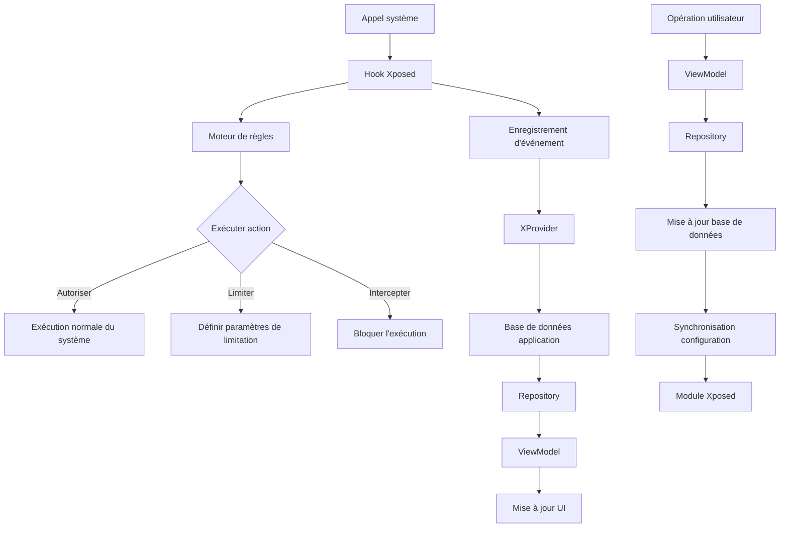

# Conception du flux de données

La conception du flux de données de NoWakeLock adopte une architecture réactive, garantissant une coordination efficace entre les événements au niveau système, les opérations utilisateur et les mises à jour de l'interface utilisateur.

## Aperçu du flux de données

### Diagramme de flux de données global


## Architecture de la couche de données

### Conception double base de données
```kotlin
// Base de données métier principale - informations application et configuration
@Database(
    entities = [
        AppInfo::class,
        WakelockRule::class,
        AlarmRule::class,
        ServiceRule::class
    ],
    version = 13,
    exportSchema = true
)
abstract class AppDatabase : RoomDatabase() {
    abstract fun appInfoDao(): AppInfoDao
    abstract fun wakelockRuleDao(): WakelockRuleDao
    // ...autres DAO
}

// Base de données d'enregistrement d'événements - données runtime
@Database(
    entities = [InfoEvent::class],
    version = 12,
    exportSchema = true
)
abstract class InfoDatabase : RoomDatabase() {
    abstract fun infoEventDao(): InfoEventDao
}
```

### Conception d'entités de données
```kotlin
// Entité informations application
@Entity(
    tableName = "appInfo",
    primaryKeys = ["packageName", "userId"],
    indices = [
        Index(value = ["packageName"]),
        Index(value = ["userId"]),
        Index(value = ["system"])
    ]
)
data class AppInfo(
    var packageName: String = "",
    var uid: Int = 0,
    var label: String = "",
    var icon: Int = 0,
    var system: Boolean = false,
    var enabled: Boolean = false,
    var persistent: Boolean = false,
    var processName: String = "",
    var userId: Int = 0,
)

// Entité enregistrement d'événement
@Entity(
    tableName = "info_event",
    indices = [
        Index(value = ["packageName", "userId"]),
        Index(value = ["type"]),
        Index(value = ["startTime"]),
        Index(value = ["isBlocked"])
    ]
)
data class InfoEvent(
    @PrimaryKey var instanceId: String = "",
    var name: String = "",
    var type: Type = Type.UnKnow,
    var packageName: String = "",
    var userId: Int = 0,
    var startTime: Long = 0,
    var endTime: Long? = null,
    var isBlocked: Boolean = false,
) {
    enum class Type {
        UnKnow, WakeLock, Alarm, Service
    }
}
```

## Flux de données Repository

### Conception d'interface Repository
```kotlin
// DA (Detection Action) Repository - dépôt de données principal
interface DARepository {
    fun getApps(userId: Int): Flow<List<AppDas>>
    fun getWakelocks(userId: Int): Flow<List<WakelockDas>>
    fun getAlarms(userId: Int): Flow<List<AlarmDas>>
    fun getServices(userId: Int): Flow<List<ServiceDas>>
    
    suspend fun updateRule(rule: Rule)
    suspend fun deleteRule(rule: Rule)
    suspend fun syncAppInfo()
}

// Repository détails application
interface AppDetailRepository {
    fun getAppDetail(packageName: String, userId: Int): Flow<AppDetail>
    fun getAppEvents(packageName: String, userId: Int): Flow<List<InfoEvent>>
    suspend fun updateAppConfig(config: AppConfig)
}
```

### Implémentation Repository
```kotlin
class DARepositoryImpl(
    private val appInfoDao: AppInfoDao,
    private val infoEventDao: InfoEventDao,
    private val wakelockRuleDao: WakelockRuleDao,
    private val xProvider: XProvider
) : DARepository {
    
    override fun getApps(userId: Int): Flow<List<AppDas>> {
        return combine(
            appInfoDao.getAppsByUser(userId),
            infoEventDao.getEventStatsByUser(userId)
        ) { apps, eventStats ->
            apps.map { app ->
                val stats = eventStats[app.packageName] ?: EventStats()
                AppDas(
                    appInfo = app,
                    wakelockCount = stats.wakelockCount,
                    alarmCount = stats.alarmCount,
                    serviceCount = stats.serviceCount,
                    lastActivity = stats.lastActivity
                )
            }
        }.distinctUntilChanged()
    }
    
    override suspend fun updateRule(rule: Rule) {
        when (rule.type) {
            RuleType.WAKELOCK -> wakelockRuleDao.insertOrUpdate(rule.toWakelockRule())
            RuleType.ALARM -> alarmRuleDao.insertOrUpdate(rule.toAlarmRule())
            RuleType.SERVICE -> serviceRuleDao.insertOrUpdate(rule.toServiceRule())
        }
        
        // Synchroniser vers le module Xposed
        xProvider.syncRule(rule)
    }
}
```

## Flux de données ViewModel

### Modèle de gestion d'état
```kotlin
// Définition d'état UI
data class DAsUiState(
    val apps: List<AppDas> = emptyList(),
    val isLoading: Boolean = false,
    val searchQuery: String = "",
    val filterOption: FilterOption = FilterOption.ALL,
    val sortOption: SortOption = SortOption.NAME,
    val currentUserId: Int = 0,
    val error: String? = null
)

// Implémentation ViewModel
class DAsViewModel(
    private val repository: DARepository,
    private val userRepository: UserPreferencesRepository
) : ViewModel() {
    
    private val _uiState = MutableStateFlow(DAsUiState())
    val uiState: StateFlow<DAsUiState> = _uiState.asStateFlow()
    
    init {
        loadInitialData()
    }
    
    private fun loadInitialData() {
        viewModelScope.launch {
            combine(
                repository.getApps(uiState.value.currentUserId),
                userRepository.searchQuery,
                userRepository.filterOption,
                userRepository.sortOption
            ) { apps, query, filter, sort ->
                apps.filter { app ->
                    // Logique de recherche et filtrage d'applications
                    app.matchesQuery(query) && app.matchesFilter(filter)
                }.sortedWith(sort.comparator)
            }.catch { error ->
                _uiState.update { it.copy(error = error.message) }
            }.collect { filteredApps ->
                _uiState.update { 
                    it.copy(
                        apps = filteredApps,
                        isLoading = false
                    ) 
                }
            }
        }
    }
}
```

### Processus de mise à jour des données
```kotlin
// Flux de données déclenché par l'opération utilisateur
fun updateWakelockRule(packageName: String, tag: String, action: ActionType) {
    viewModelScope.launch {
        try {
            val rule = WakelockRule(
                packageName = packageName,
                tag = tag,
                action = action,
                userId = uiState.value.currentUserId
            )
            
            repository.updateRule(rule)
            
            // L'UI se met à jour automatiquement via Flow, pas besoin de rafraîchissement manuel
        } catch (e: Exception) {
            _uiState.update { it.copy(error = e.message) }
        }
    }
}
```

## Communication inter-processus

### Pont de données XProvider
```kotlin
class XProvider private constructor() {
    
    companion object {
        private const val AUTHORITY = "com.js.nowakelock.xprovider"
        
        // Processus d'insertion d'événement
        fun insertEvent(event: InfoEvent) {
            try {
                val data = bundleOf(
                    "instanceId" to event.instanceId,
                    "name" to event.name,
                    "type" to event.type.ordinal,
                    "packageName" to event.packageName,
                    "userId" to event.userId,
                    "startTime" to event.startTime,
                    "isBlocked" to event.isBlocked
                )
                
                // Utiliser SystemProperties pour la communication inter-processus
                val serialized = serializeBundle(data)
                SystemProperties.set("sys.nowakelock.event", serialized)
                
            } catch (e: Exception) {
                XposedBridge.log("Échec insertEvent XProvider : ${e.message}")
            }
        }
        
        // Processus de synchronisation de règles
        fun syncRule(rule: Rule) {
            try {
                val data = bundleOf(
                    "id" to rule.id,
                    "packageName" to rule.packageName,
                    "target" to rule.target,
                    "action" to rule.action.ordinal,
                    "type" to rule.type.ordinal
                )
                
                val serialized = serializeBundle(data)
                SystemProperties.set("sys.nowakelock.rule.${rule.id}", serialized)
                
            } catch (e: Exception) {
                XposedBridge.log("Échec syncRule XProvider : ${e.message}")
            }
        }
    }
}
```

### Mécanisme de synchronisation des données
```kotlin
class DataSynchronizer(
    private val appInfoDao: AppInfoDao,
    private val infoEventDao: InfoEventDao
) {
    
    // Synchronisation périodique des informations d'application
    suspend fun syncAppInfo() {
        try {
            val packageManager = context.packageManager
            val installedApps = packageManager.getInstalledApplications(0)
            
            val appInfoList = installedApps.map { appInfo ->
                AppInfo(
                    packageName = appInfo.packageName,
                    uid = appInfo.uid,
                    label = appInfo.loadLabel(packageManager).toString(),
                    system = (appInfo.flags and ApplicationInfo.FLAG_SYSTEM) != 0,
                    enabled = appInfo.enabled,
                    processName = appInfo.processName ?: appInfo.packageName,
                    userId = UserHandle.getUserId(appInfo.uid)
                )
            }
            
            appInfoDao.insertOrUpdateAll(appInfoList)
            
        } catch (e: Exception) {
            Log.e("DataSync", "Échec synchronisation infos app", e)
        }
    }
    
    // Lecture des données d'événement depuis le module Xposed
    suspend fun syncEventData() {
        try {
            // Lire les données d'événement dans les propriétés système
            val eventData = SystemProperties.get("sys.nowakelock.events", "")
            if (eventData.isNotEmpty()) {
                val events = deserializeEvents(eventData)
                infoEventDao.insertAll(events)
                
                // Effacer les données déjà lues
                SystemProperties.set("sys.nowakelock.events", "")
            }
        } catch (e: Exception) {
            Log.e("DataSync", "Échec synchronisation données événement", e)
        }
    }
}
```

## Mécanisme de mise à jour en temps réel

### Réaction en chaîne Flow
```kotlin
class DataFlowManager {
    
    // Coordinateur de flux de données central
    fun setupDataFlow(): Flow<AppDataUpdate> {
        return merge(
            // 1. Flux d'événements système
            systemEventFlow(),
            // 2. Flux d'opérations utilisateur
            userActionFlow(),
            // 3. Flux de synchronisation programmée
            scheduledSyncFlow()
        ).scan(AppDataUpdate()) { accumulator, update ->
            accumulator.merge(update)
        }.distinctUntilChanged()
    }
    
    private fun systemEventFlow(): Flow<SystemEvent> {
        return callbackFlow {
            val observer = object : ContentObserver(Handler(Looper.getMainLooper())) {
                override fun onChange(selfChange: Boolean, uri: Uri?) {
                    // Écouter les changements de propriétés système
                    trySend(SystemEvent.PropertyChanged(uri))
                }
            }
            
            // Enregistrer l'écouteur
            context.contentResolver.registerContentObserver(
                Settings.Global.CONTENT_URI,
                true,
                observer
            )
            
            awaitClose {
                context.contentResolver.unregisterContentObserver(observer)
            }
        }
    }
}
```

### Déduplication de données et optimisation des performances
```kotlin
// Stratégie de déduplication de données
fun <T> Flow<List<T>>.distinctItems(): Flow<List<T>> {
    return distinctUntilChanged { old, new ->
        old.size == new.size && old.zip(new).all { (a, b) -> a == b }
    }
}

// Optimisation de mise à jour par lots
class BatchUpdateManager {
    
    private val pendingUpdates = mutableListOf<DataUpdate>()
    private val updateJob = Job()
    
    fun scheduleUpdate(update: DataUpdate) {
        synchronized(pendingUpdates) {
            pendingUpdates.add(update)
        }
        
        // Exécution différée par lots
        CoroutineScope(updateJob).launch {
            delay(100) // Fenêtre de lot de 100ms
            executeBatchUpdate()
        }
    }
    
    private suspend fun executeBatchUpdate() {
        val updates = synchronized(pendingUpdates) {
            val copy = pendingUpdates.toList()
            pendingUpdates.clear()
            copy
        }
        
        if (updates.isNotEmpty()) {
            // Fusionner et exécuter la mise à jour
            val mergedUpdate = updates.reduce { acc, update -> acc.merge(update) }
            executeUpdate(mergedUpdate)
        }
    }
}
```

## Gestion d'erreurs et récupération

### Gestion d'erreurs de flux de données
```kotlin
// Gestion d'erreurs de la couche Repository
override fun getApps(userId: Int): Flow<List<AppDas>> {
    return flow {
        emit(getAppsFromDatabase(userId))
    }.catch { exception ->
        when (exception) {
            is SQLiteException -> {
                Log.e("DARepository", "Erreur base de données", exception)
                emit(emptyList()) // Retourner liste vide comme traitement de dégradation
            }
            is SecurityException -> {
                Log.e("DARepository", "Permission refusée", exception)
                emit(getCachedApps(userId)) // Utiliser données en cache
            }
            else -> {
                Log.e("DARepository", "Erreur inattendue", exception)
                throw exception // Relancer erreur inconnue
            }
        }
    }.retry(3) { exception ->
        exception is IOException || exception is SQLiteException
    }
}

// Gestion d'erreurs de la couche ViewModel
private fun handleError(error: Throwable) {
    val errorMessage = when (error) {
        is NetworkException -> "Échec connexion réseau, veuillez vérifier les paramètres réseau"
        is DatabaseException -> "Échec chargement données, veuillez réessayer"
        is PermissionException -> "Permissions insuffisantes, veuillez vérifier les permissions de l'application"
        else -> "Erreur inconnue : ${error.message}"
    }
    
    _uiState.update { 
        it.copy(
            error = errorMessage,
            isLoading = false
        ) 
    }
}
```

### Garantie de cohérence des données
```kotlin
class DataConsistencyManager {
    
    // Validation des données
    suspend fun validateDataConsistency() {
        val inconsistencies = mutableListOf<DataInconsistency>()
        
        // 1. Vérifier les événements orphelins
        val orphanEvents = infoEventDao.getOrphanEvents()
        if (orphanEvents.isNotEmpty()) {
            inconsistencies.add(DataInconsistency.OrphanEvents(orphanEvents))
        }
        
        // 2. Vérifier les règles dupliquées
        val duplicateRules = ruleDao.getDuplicateRules()
        if (duplicateRules.isNotEmpty()) {
            inconsistencies.add(DataInconsistency.DuplicateRules(duplicateRules))
        }
        
        // 3. Corriger les incohérences de données
        inconsistencies.forEach { inconsistency ->
            fixInconsistency(inconsistency)
        }
    }
    
    private suspend fun fixInconsistency(inconsistency: DataInconsistency) {
        when (inconsistency) {
            is DataInconsistency.OrphanEvents -> {
                // Supprimer les événements orphelins ou créer des informations d'application par défaut
                infoEventDao.deleteOrphanEvents()
            }
            is DataInconsistency.DuplicateRules -> {
                // Fusionner les règles dupliquées
                mergeDuplicateRules(inconsistency.rules)
            }
        }
    }
}
```

## Surveillance des performances

### Métriques de performance de flux de données
```kotlin
class DataFlowMetrics {
    
    fun trackFlowPerformance() {
        repository.getApps(userId)
            .onStart { startTime = System.currentTimeMillis() }
            .onEach { apps ->
                val duration = System.currentTimeMillis() - startTime
                Log.d("Performance", "Apps chargées en ${duration}ms, nombre : ${apps.size}")
                
                if (duration > 1000) {
                    Log.w("Performance", "Chargement de données lent détecté")
                }
            }
            .catch { exception ->
                Log.e("Performance", "Erreur flux de données", exception)
            }
            .flowOn(Dispatchers.IO)
            .collect()
    }
}
```

!!! info "Caractéristiques du flux de données"
    La conception du flux de données de NoWakeLock tire pleinement parti des caractéristiques réactives de Kotlin Flow, garantissant la nature temps réel et la cohérence des données.

!!! tip "Optimisation des performances"
    L'utilisation de `distinctUntilChanged()` et de mécanismes de mise à jour par lots peut considérablement réduire les mises à jour inutiles de l'interface utilisateur, améliorant les performances de l'application.