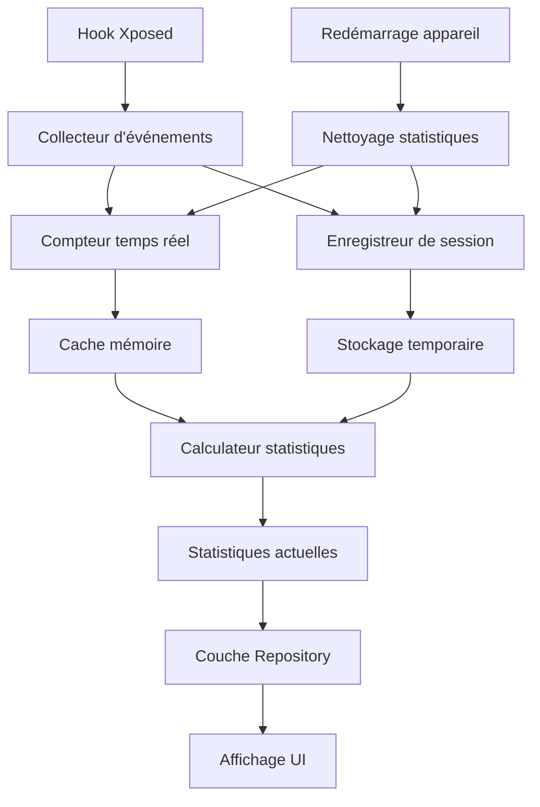

# Système de compteurs

Le système de compteurs de NoWakeLock est responsable des statistiques en temps réel des activités WakeLock, Alarm et Service de la session actuelle, fournissant aux utilisateurs l'état d'utilisation actuel et les métriques de performance. Le système adopte des statistiques au niveau de la session, redémarrant le comptage après le redémarrage de l'appareil.

## Architecture des compteurs

### Vue d'ensemble du système


### Composants principaux
```kotlin
// Interface collecteur d'événements
interface EventCollector {
    fun recordEvent(event: SystemEvent)
    fun getCurrentStats(): CurrentSessionStats
    fun resetStats() // Nettoyage après redémarrage
}

// Gestionnaire de compteurs
class CounterManager(
    private val realtimeCounter: RealtimeCounter,
    private val sessionRecorder: SessionRecorder,
    private val statisticsCalculator: StatisticsCalculator
) : EventCollector {
    
    override fun recordEvent(event: SystemEvent) {
        // Comptage temps réel
        realtimeCounter.increment(event)
        
        // Enregistrement de session (nettoyé après redémarrage)
        sessionRecorder.store(event)
        
        // Déclenchement mise à jour statistiques
        if (shouldUpdateStatistics(event)) {
            statisticsCalculator.recalculate(event.packageName)
        }
    }
    
    override fun resetStats() {
        // Appelé par BootResetManager après détection redémarrage
        realtimeCounter.clear()
        sessionRecorder.clear()
    }
}
```

## Compteur temps réel

### Implémentation RealtimeCounter
```kotlin
class RealtimeCounter {
    
    // Utilisation de structures de données thread-safe
    private val wakelockCounters = ConcurrentHashMap<String, AtomicCounterData>()
    private val alarmCounters = ConcurrentHashMap<String, AtomicCounterData>()
    private val serviceCounters = ConcurrentHashMap<String, AtomicCounterData>()
    
    // Suivi des états actifs
    private val activeWakelocks = ConcurrentHashMap<String, WakelockSession>()
    private val activeServices = ConcurrentHashMap<String, ServiceSession>()
    
    fun increment(event: SystemEvent) {
        when (event.type) {
            EventType.WAKELOCK_ACQUIRE -> handleWakelockAcquire(event)
            EventType.WAKELOCK_RELEASE -> handleWakelockRelease(event)
            EventType.ALARM_TRIGGER -> handleAlarmTrigger(event)
            EventType.SERVICE_START -> handleServiceStart(event)
            EventType.SERVICE_STOP -> handleServiceStop(event)
        }
    }
    
    private fun handleWakelockAcquire(event: SystemEvent) {
        val key = "${event.packageName}:${event.name}"
        
        // Incrémenter compteur d'acquisition
        wakelockCounters.computeIfAbsent(key) { 
            AtomicCounterData() 
        }.acquireCount.incrementAndGet()
        
        // Enregistrer état actif
        activeWakelocks[event.instanceId] = WakelockSession(
            packageName = event.packageName,
            tag = event.name,
            startTime = event.timestamp,
            flags = event.flags
        )
        
        // Mettre à jour statistiques niveau application
        updateAppLevelStats(event.packageName, EventType.WAKELOCK_ACQUIRE)
    }
    
    private fun handleWakelockRelease(event: SystemEvent) {
        val session = activeWakelocks.remove(event.instanceId) ?: return
        val key = "${session.packageName}:${session.tag}"
        
        val duration = event.timestamp - session.startTime
        
        wakelockCounters[key]?.let { counter ->
            // Mettre à jour durée de maintien
            counter.totalDuration.addAndGet(duration)
            counter.releaseCount.incrementAndGet()
            
            // Mettre à jour durée de maintien maximale
            counter.updateMaxDuration(duration)
        }
        
        // Mettre à jour statistiques niveau application
        updateAppLevelStats(session.packageName, EventType.WAKELOCK_RELEASE, duration)
    }
    
    private fun handleAlarmTrigger(event: SystemEvent) {
        val key = "${event.packageName}:${event.name}"
        
        alarmCounters.computeIfAbsent(key) {
            AtomicCounterData()
        }.let { counter ->
            counter.triggerCount.incrementAndGet()
            counter.lastTriggerTime.set(event.timestamp)
            
            // Calculer intervalle déclenchement
            val interval = event.timestamp - counter.previousTriggerTime.getAndSet(event.timestamp)
            if (interval > 0) {
                counter.updateTriggerInterval(interval)
            }
        }
        
        updateAppLevelStats(event.packageName, EventType.ALARM_TRIGGER)
    }
}

// Données compteur atomique
class AtomicCounterData {
    // Compteurs WakeLock
    val acquireCount = AtomicLong(0)
    val releaseCount = AtomicLong(0)
    val totalDuration = AtomicLong(0)
    val maxDuration = AtomicLong(0)
    
    // Compteurs Alarm
    val triggerCount = AtomicLong(0)
    val lastTriggerTime = AtomicLong(0)
    val previousTriggerTime = AtomicLong(0)
    val minInterval = AtomicLong(Long.MAX_VALUE)
    val maxInterval = AtomicLong(0)
    val totalInterval = AtomicLong(0)
    
    // Compteurs Service
    val startCount = AtomicLong(0)
    val stopCount = AtomicLong(0)
    val runningDuration = AtomicLong(0)
    
    // Méthodes génériques
    fun updateMaxDuration(duration: Long) {
        maxDuration.accumulateAndGet(duration) { current, new -> maxOf(current, new) }
    }
    
    fun updateTriggerInterval(interval: Long) {
        minInterval.accumulateAndGet(interval) { current, new -> minOf(current, new) }
        maxInterval.accumulateAndGet(interval) { current, new -> maxOf(current, new) }
        totalInterval.addAndGet(interval)
    }
    
    fun snapshot(): CounterSnapshot {
        return CounterSnapshot(
            acquireCount = acquireCount.get(),
            releaseCount = releaseCount.get(),
            totalDuration = totalDuration.get(),
            maxDuration = maxDuration.get(),
            triggerCount = triggerCount.get(),
            avgInterval = if (triggerCount.get() > 1) {
                totalInterval.get() / (triggerCount.get() - 1)
            } else 0,
            minInterval = if (minInterval.get() == Long.MAX_VALUE) 0 else minInterval.get(),
            maxInterval = maxInterval.get()
        )
    }
}
```

### Suivi de session
```kotlin
// Données de session WakeLock
data class WakelockSession(
    val packageName: String,
    val tag: String,
    val startTime: Long,
    val flags: Int,
    val uid: Int = 0,
    val pid: Int = 0
) {
    val duration: Long get() = System.currentTimeMillis() - startTime
    val isLongRunning: Boolean get() = duration > 60_000 // Plus de 1 minute
}

// Données de session Service
data class ServiceSession(
    val packageName: String,
    val serviceName: String,
    val startTime: Long,
    val isForeground: Boolean = false,
    val instanceCount: Int = 1
) {
    val duration: Long get() = System.currentTimeMillis() - startTime
    val isLongRunning: Boolean get() = duration > 300_000 // Plus de 5 minutes
}

// Gestionnaire de sessions
class SessionManager {
    
    private val activeWakelocks = ConcurrentHashMap<String, WakelockSession>()
    private val activeServices = ConcurrentHashMap<String, ServiceSession>()
    private val sessionHistory = LRUCache<String, List<SessionRecord>>(1000)
    
    fun startWakelockSession(instanceId: String, session: WakelockSession) {
        activeWakelocks[instanceId] = session
        scheduleSessionTimeout(instanceId, session.tag, 300_000) // Timeout 5 minutes
    }
    
    fun endWakelockSession(instanceId: String): WakelockSession? {
        val session = activeWakelocks.remove(instanceId)
        session?.let {
            recordSessionHistory(it)
            cancelSessionTimeout(instanceId)
        }
        return session
    }
    
    fun getActiveSessions(): SessionSummary {
        return SessionSummary(
            activeWakelocks = activeWakelocks.values.toList(),
            activeServices = activeServices.values.toList(),
            totalActiveTime = calculateTotalActiveTime(),
            longestRunningSession = findLongestRunningSession()
        )
    }
    
    private fun scheduleSessionTimeout(instanceId: String, tag: String, timeout: Long) {
        // Utiliser coroutines pour traitement timeout différé
        CoroutineScope(Dispatchers.IO).launch {
            delay(timeout)
            if (activeWakelocks.containsKey(instanceId)) {
                XposedBridge.log("WakeLock timeout: $tag (${timeout}ms)")
                // Forcer libération WakeLock timeout
                forceReleaseWakeLock(instanceId)
            }
        }
    }
}
```

## Enregistreur de session

### Implémentation SessionRecorder
```kotlin
class SessionRecorder(
    private val database: InfoDatabase
) {
    
    private val eventBuffer = ConcurrentLinkedQueue<InfoEvent>()
    private val bufferSize = AtomicInteger(0)
    private val maxBufferSize = 1000
    
    fun store(event: SystemEvent) {
        val infoEvent = event.toInfoEvent()
        
        // Ajouter au tampon (session actuelle uniquement)
        eventBuffer.offer(infoEvent)
        
        // Vérifier si écriture en lot nécessaire
        if (bufferSize.incrementAndGet() >= maxBufferSize) {
            flushBuffer()
        }
    }
    
    private fun flushBuffer() {
        val events = mutableListOf<InfoEvent>()
        
        // Extraire événements en lot
        while (events.size < maxBufferSize && !eventBuffer.isEmpty()) {
            eventBuffer.poll()?.let { events.add(it) }
        }
        
        if (events.isNotEmpty()) {
            CoroutineScope(Dispatchers.IO).launch {
                try {
                    // Note : InfoDatabase appelle clearAllTables() lors initialisation
                    // Les données sont nettoyées après redémarrage par BootResetManager
                    database.infoEventDao().insertAll(events)
                    bufferSize.addAndGet(-events.size)
                } catch (e: Exception) {
                    XposedBridge.log("Failed to store session events: ${e.message}")
                    // Remettre en file pour retry
                    events.forEach { eventBuffer.offer(it) }
                }
            }
        }
    }
    
    fun getCurrentSessionStats(
        packageName: String?,
        type: EventType?
    ): CurrentSessionStats {
        return runBlocking {
            // Requête données session actuelle uniquement (effacées après redémarrage)
            val events = database.infoEventDao().getCurrentSessionEvents(
                packageName = packageName,
                type = type?.toInfoEventType()
            )
            
            calculateCurrentSessionStats(events)
        }
    }
    
    fun clear() {
        // Nettoyage données après redémarrage
        eventBuffer.clear()
        bufferSize.set(0)
    }
}

// Gestionnaire détection redémarrage
class BootResetManager(
    private val database: InfoDatabase,
    private val realtimeCounter: RealtimeCounter
) {
    
    fun checkAndResetAfterBoot(): Boolean {
        val bootTime = SystemClock.elapsedRealtime()
        val lastBootTime = getLastBootTime()
        
        // Détecter redémarrage
        val isAfterReboot = bootTime < lastBootTime || lastBootTime == 0L
        
        if (isAfterReboot) {
            // Nettoyer toutes statistiques
            resetAllStatistics()
            saveLastBootTime(bootTime)
            XposedBridge.log("Device rebooted, statistics reset")
            return true
        }
        
        return false
    }
    
    private fun resetAllStatistics() {
        // Nettoyer tables base de données (InfoDatabase se nettoie aussi lors initialisation)
        database.infoEventDao().clearAll()
        database.infoDao().clearAll()
        
        // Nettoyer compteurs mémoire
        realtimeCounter.clear()
    }
}
```

## Calculateur de statistiques

### Implémentation StatisticsCalculator
```kotlin
class StatisticsCalculator(
    private val realtimeCounter: RealtimeCounter,
    private val sessionRecorder: SessionRecorder,
    private val database: InfoDatabase
) {
    
    fun calculateCurrentAppStatistics(packageName: String): CurrentAppStatistics {
        val realtimeStats = realtimeCounter.getAppStats(packageName)
        val sessionStats = sessionRecorder.getCurrentSessionStats(packageName, null)
        
        return CurrentAppStatistics(
            packageName = packageName,
            sessionStartTime = getSessionStartTime(),
            wakelockStats = calculateCurrentWakelockStats(packageName),
            alarmStats = calculateCurrentAlarmStats(packageName),
            serviceStats = calculateCurrentServiceStats(packageName),
            currentMetrics = calculateCurrentMetrics(packageName)
        )
    }
    
    private fun calculateCurrentWakelockStats(packageName: String): CurrentWakelockStats {
        val events = runBlocking {
            // Requête données session actuelle uniquement (effacées après redémarrage)
            database.infoEventDao().getCurrentSessionWakelockEvents(packageName)
        }
        
        val activeEvents = events.filter { it.endTime == null }
        val completedEvents = events.filter { it.endTime != null }
        
        return CurrentWakelockStats(
            totalAcquires = events.size,
            totalReleases = completedEvents.size,
            currentlyActive = activeEvents.size,
            totalDuration = completedEvents.sumOf { it.duration },
            averageDuration = if (completedEvents.isNotEmpty()) {
                completedEvents.map { it.duration }.average().toLong()
            } else 0,
            maxDuration = completedEvents.maxOfOrNull { it.duration } ?: 0,
            blockedCount = events.count { it.isBlocked },
            blockRate = if (events.isNotEmpty()) {
                events.count { it.isBlocked }.toFloat() / events.size
            } else 0f,
            topTags = calculateTopWakelockTags(events),
            recentActivity = calculateRecentActivity(events)
        )
    }
    
    private fun calculateCurrentAlarmStats(packageName: String): CurrentAlarmStats {
        val events = runBlocking {
            database.infoEventDao().getCurrentSessionAlarmEvents(packageName)
        }
        
        val triggerIntervals = calculateTriggerIntervals(events)
        
        return CurrentAlarmStats(
            totalTriggers = events.size,
            blockedTriggers = events.count { it.isBlocked },
            blockRate = if (events.isNotEmpty()) {
                events.count { it.isBlocked }.toFloat() / events.size
            } else 0f,
            averageInterval = triggerIntervals.average().toLong(),
            recentTriggers = events.takeLast(10), // 10 derniers déclenchements
            topTags = calculateTopAlarmTags(events)
        )
    }
    
    private fun calculatePerformanceMetrics(packageName: String, timeRange: TimeRange): PerformanceMetrics {
        val events = runBlocking {
            database.infoEventDao().getEventsByPackage(
                packageName = packageName,
                startTime = timeRange.startTime,
                endTime = timeRange.endTime
            )
        }
        
        return PerformanceMetrics(
            totalEvents = events.size,
            eventsPerHour = calculateEventsPerHour(events, timeRange),
            averageCpuUsage = events.map { it.cpuUsage }.average().toFloat(),
            averageMemoryUsage = events.map { it.memoryUsage }.average().toLong(),
            totalBatteryDrain = events.sumOf { it.batteryDrain.toDouble() }.toFloat(),
            efficiencyRating = calculateOverallEfficiency(events),
            resourceIntensity = calculateResourceIntensity(events),
            backgroundActivityRatio = calculateBackgroundRatio(events)
        )
    }
}

// Classes de données statistiques (session actuelle)
data class CurrentAppStatistics(
    val packageName: String,
    val sessionStartTime: Long, // Début session actuelle (réinitialisé après redémarrage)
    val wakelockStats: CurrentWakelockStats,
    val alarmStats: CurrentAlarmStats,
    val serviceStats: CurrentServiceStats,
    val currentMetrics: CurrentMetrics
)

data class CurrentWakelockStats(
    val totalAcquires: Int,
    val totalReleases: Int,
    val currentlyActive: Int,
    val totalDuration: Long,
    val averageDuration: Long,
    val maxDuration: Long,
    val blockedCount: Int,
    val blockRate: Float,
    val topTags: List<TagCount>,
    val recentActivity: List<RecentEvent> // Activité récente, pas tendance historique
)

data class CurrentAlarmStats(
    val totalTriggers: Int,
    val blockedTriggers: Int,
    val blockRate: Float,
    val averageInterval: Long,
    val recentTriggers: List<InfoEvent>, // Enregistrements déclenchements récents
    val topTags: List<TagCount>
)

data class CurrentServiceStats(
    val totalStarts: Int,
    val currentlyRunning: Int,
    val averageRuntime: Long,
    val blockedStarts: Int,
    val blockRate: Float,
    val topServices: List<ServiceCount>
)

data class CurrentMetrics(
    val totalEvents: Int,
    val eventsPerHour: Double, // Fréquence événements session actuelle
    val sessionDuration: Long, // Durée session
    val averageResponseTime: Long, // Temps réponse moyen
    val systemLoad: Float // Métriques charge système
)

data class RecentEvent(
    val timestamp: Long,
    val name: String,
    val action: String, // acquire/release/block
    val duration: Long?
)

data class TagCount(
    val tag: String,
    val count: Int,
    val percentage: Float
)

data class ServiceCount(
    val serviceName: String,
    val startCount: Int,
    val runningTime: Long
)
```

## Mécanisme de nettoyage des données

### Détection redémarrage et nettoyage
```kotlin
// Implémentation BootResetManager dans le code réel
class BootResetManager(
    private val context: Context,
    private val userPreferencesRepository: UserPreferencesRepository
) {
    
    suspend fun checkAndResetIfNeeded(): Boolean {
        val currentBootTime = SystemClock.elapsedRealtime()
        val lastRecordedTime = userPreferencesRepository.getLastBootTime().first()
        val resetDone = userPreferencesRepository.getResetDone().first()
        
        // Détecter redémarrage : temps actuel < temps enregistré précédent
        val isAfterReboot = currentBootTime < lastRecordedTime || lastRecordedTime == 0L
        
        if (isAfterReboot || !resetDone) {
            resetTables() // Nettoyer tables base de données
            userPreferencesRepository.setLastBootTime(currentBootTime)
            userPreferencesRepository.setResetDone(true)
            return true
        }
        return false
    }
    
    private suspend fun resetTables() {
        val db = AppDatabase.getInstance(context)
        // Vider tables statistiques et événements
        db.infoDao().clearAll()
        db.infoEventDao().clearAll()
    }
}

// Nettoyage automatique dans XProvider
class XProvider {
    companion object {
        private var db: InfoDatabase = InfoDatabase.getInstance(context).also { 
            it.clearAllTables() // Vider à chaque initialisation
        }
    }
}
```

### Pourquoi nettoyer les données historiques

**Philosophie de conception** :
- **Contrôle temps réel ne nécessite pas données historiques** - Décisions interception WakeLock/Alarm sont instantanées
- **Statistiques affichent session actuelle** - Utilisateurs s'intéressent à consommation batterie actuelle
- **Éviter accumulation données** - Événements WakeLock historiques sans valeur pour système
- **Maintenir système propre** - Redémarrage nouveau départ reflète mieux utilisation réelle

## Optimisation des performances

### Stratégie de cache
```kotlin
class SessionStatisticsCache {
    
    private val cache = LRUCache<String, CacheEntry>(50) // Réduire taille cache
    private val cacheExpiry = 60_000L // Expiration 1 minute (cache court terme)
    
    fun getCurrentAppStatistics(packageName: String): CurrentAppStatistics? {
        val key = "current_${packageName}"
        val entry = cache.get(key)
        
        return if (entry != null && !entry.isExpired()) {
            entry.statistics
        } else {
            null
        }
    }
    
    fun putCurrentAppStatistics(packageName: String, statistics: CurrentAppStatistics) {
        val key = "current_${packageName}"
        cache.put(key, CacheEntry(statistics, System.currentTimeMillis() + cacheExpiry))
    }
    
    fun clearOnReboot() {
        // Nettoyer tous caches après redémarrage
        cache.evictAll()
    }
    
    private data class CacheEntry(
        val statistics: CurrentAppStatistics,
        val expiryTime: Long
    ) {
        fun isExpired(): Boolean = System.currentTimeMillis() > expiryTime
    }
}

// Gestionnaire calculs légers
class LightweightStatsManager(
    private val realtimeCounter: RealtimeCounter,
    private val cache: SessionStatisticsCache
) {
    
    // Calculer uniquement données temps réel nécessaires
    fun getQuickStats(packageName: String): QuickStats {
        val cached = cache.getCurrentAppStatistics(packageName)
        if (cached != null) return cached.toQuickStats()
        
        // Calcul léger
        val realtime = realtimeCounter.getAppStats(packageName)
        return QuickStats(
            activeWakelocks = realtime.activeWakelocks,
            totalEvents = realtime.totalEvents,
            blockedEvents = realtime.blockedEvents,
            sessionUptime = System.currentTimeMillis() - getSessionStartTime()
        )
    }
}

data class QuickStats(
    val activeWakelocks: Int,
    val totalEvents: Int,
    val blockedEvents: Int,
    val sessionUptime: Long
)
```

!!! info "Principes de conception des compteurs"
    Le système de compteurs de NoWakeLock adopte une conception au niveau session, optimisée pour les fonctionnalités de contrôle temps réel du module Xposed. L'accent est mis sur l'affichage temps réel de l'état actuel, plutôt que sur l'analyse de données à long terme.

!!! tip "Pourquoi ne pas sauvegarder les données historiques"
    - **Contrôle temps réel ne nécessite pas données historiques** : Décisions interception WakeLock/Alarm basées sur événements et règles actuels
    - **Statistiques nécessitent uniquement session actuelle** : Utilisateurs s'intéressent à consommation batterie et état système actuels
    - **Prévenir accumulation données** : Événements WakeLock historiques sans valeur pratique pour gestion système
    - **Maintenir système léger** : Nettoyage données redémarrage assure fonctionnement efficace module

!!! warning "Cycle de vie des données"
    - **Compteur temps réel** : Sauvegardé en mémoire, vidé redémarrage processus
    - **Enregistreur session** : Stockage temporaire base de données, vidé redémarrage appareil
    - **Données statistiques** : Existent uniquement session actuelle, pas sauvegarde inter-redémarrage