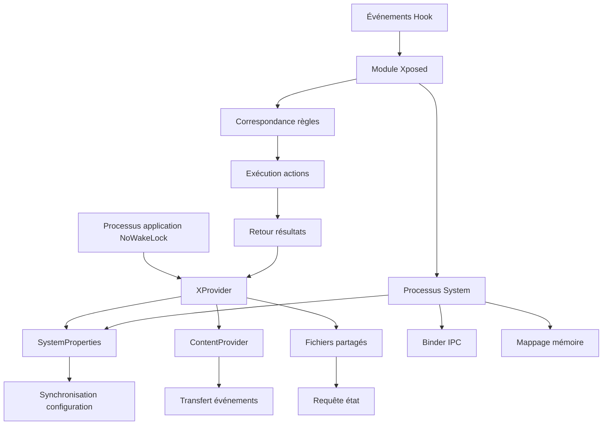

# Communication inter-processus (IPC)

Le système IPC de NoWakeLock est responsable de l'échange de données entre le module Xposed et le processus d'application, assurant la fiabilité de la synchronisation de configuration, du transfert d'événements et des requêtes d'état.

## Aperçu de l'architecture IPC

### Modèle de communication


### Composants principaux
```kotlin
// Interface gestionnaire IPC
interface IPCManager {
    fun sendEvent(event: IPCEvent): Boolean
    fun queryConfiguration(query: ConfigQuery): ConfigResult?
    fun updateRule(rule: Rule): Boolean
    fun getSystemStatus(): SystemStatus
}

// Classe d'implémentation principale
class XProviderIPCManager : IPCManager {
    
    private val systemPropertiesChannel = SystemPropertiesChannel()
    private val contentProviderChannel = ContentProviderChannel()
    private val fileSystemChannel = FileSystemChannel()
    
    override fun sendEvent(event: IPCEvent): Boolean {
        return when (event.priority) {
            Priority.CRITICAL -> systemPropertiesChannel.send(event)
            Priority.HIGH -> contentProviderChannel.send(event)
            Priority.NORMAL -> fileSystemChannel.send(event)
            Priority.LOW -> fileSystemChannel.sendBatched(event)
        }
    }
}
```

## Canal SystemProperties

### Communication temps réel haute priorité
```kotlin
class SystemPropertiesChannel {
    
    companion object {
        private const val PROP_PREFIX = "sys.nowakelock."
        private const val MAX_PROP_SIZE = 92 // Limite système Android
        private const val EVENT_PROP = "${PROP_PREFIX}event"
        private const val CONFIG_PROP = "${PROP_PREFIX}config"
        private const val STATUS_PROP = "${PROP_PREFIX}status"
        private const val SYNC_PROP = "${PROP_PREFIX}sync"
    }
    
    // Envoyer événement vers propriétés système
    fun sendEvent(event: IPCEvent): Boolean {
        return try {
            val serialized = serializeEvent(event)
            if (serialized.length <= MAX_PROP_SIZE) {
                SystemProperties.set(EVENT_PROP, serialized)
                true
            } else {
                // Transmission fragmentée pour grandes données
                sendChunkedData(EVENT_PROP, serialized)
            }
        } catch (e: Exception) {
            XposedBridge.log("Failed to send event via SystemProperties: ${e.message}")
            false
        }
    }
    
    // Transmission fragmentée grandes données
    private fun sendChunkedData(property: String, data: String): Boolean {
        val chunks = data.chunked(MAX_PROP_SIZE - 10) // Réserver espace identifiant fragment
        val chunkCount = chunks.size
        
        try {
            // Définir nombre de fragments
            SystemProperties.set("${property}.chunks", chunkCount.toString())
            
            // Envoyer chaque fragment
            chunks.forEachIndexed { index, chunk ->
                SystemProperties.set("${property}.$index", chunk)
            }
            
            // Définir indicateur complétion
            SystemProperties.set("${property}.complete", System.currentTimeMillis().toString())
            return true
        } catch (e: Exception) {
            XposedBridge.log("Failed to send chunked data: ${e.message}")
            return false
        }
    }
    
    // Recevoir événement
    fun receiveEvent(): IPCEvent? {
        return try {
            val data = SystemProperties.get(EVENT_PROP, "")
            if (data.isNotEmpty()) {
                // Effacer données lues
                SystemProperties.set(EVENT_PROP, "")
                deserializeEvent(data)
            } else {
                // Vérifier données fragmentées
                receiveChunkedData(EVENT_PROP)
            }
        } catch (e: Exception) {
            XposedBridge.log("Failed to receive event: ${e.message}")
            null
        }
    }
    
    private fun receiveChunkedData(property: String): IPCEvent? {
        val chunkCountStr = SystemProperties.get("${property}.chunks", "")
        if (chunkCountStr.isEmpty()) return null
        
        val chunkCount = chunkCountStr.toIntOrNull() ?: return null
        val chunks = mutableListOf<String>()
        
        // Collecter tous fragments
        for (i in 0 until chunkCount) {
            val chunk = SystemProperties.get("${property}.$i", "")
            if (chunk.isEmpty()) return null // Fragment manquant
            chunks.add(chunk)
        }
        
        // Vérifier indicateur complétion
        val completeTime = SystemProperties.get("${property}.complete", "")
        if (completeTime.isEmpty()) return null
        
        // Nettoyer données fragmentées
        SystemProperties.set("${property}.chunks", "")
        for (i in 0 until chunkCount) {
            SystemProperties.set("${property}.$i", "")
        }
        SystemProperties.set("${property}.complete", "")
        
        // Reconstituer données
        val fullData = chunks.joinToString("")
        return deserializeEvent(fullData)
    }
}
```

### Sérialisation événements
```kotlin
object EventSerializer {
    
    // Format sérialisation compact
    fun serializeEvent(event: IPCEvent): String {
        return when (event.type) {
            IPCEventType.WAKELOCK_EVENT -> serializeWakelockEvent(event as WakelockIPCEvent)
            IPCEventType.ALARM_EVENT -> serializeAlarmEvent(event as AlarmIPCEvent)
            IPCEventType.SERVICE_EVENT -> serializeServiceEvent(event as ServiceIPCEvent)
            IPCEventType.RULE_UPDATE -> serializeRuleUpdate(event as RuleUpdateEvent)
            IPCEventType.CONFIG_SYNC -> serializeConfigSync(event as ConfigSyncEvent)
        }
    }
    
    private fun serializeWakelockEvent(event: WakelockIPCEvent): String {
        // Format compact : type|timestamp|packageName|tag|action|flags|...
        return buildString {
            append("WL") // Identifiant type
            append("|${event.timestamp}")
            append("|${event.packageName}")
            append("|${event.tag}")
            append("|${event.action.ordinal}")
            append("|${event.flags}")
            append("|${event.uid}")
            append("|${if (event.isBlocked) 1 else 0}")
            if (event.instanceId.isNotEmpty()) {
                append("|${event.instanceId}")
            }
        }
    }
    
    fun deserializeEvent(data: String): IPCEvent? {
        val parts = data.split("|")
        if (parts.size < 3) return null
        
        return when (parts[0]) {
            "WL" -> deserializeWakelockEvent(parts)
            "AL" -> deserializeAlarmEvent(parts)
            "SV" -> deserializeServiceEvent(parts)
            "RU" -> deserializeRuleUpdate(parts)
            "CS" -> deserializeConfigSync(parts)
            else -> null
        }
    }
    
    private fun deserializeWakelockEvent(parts: List<String>): WakelockIPCEvent? {
        if (parts.size < 8) return null
        
        return try {
            WakelockIPCEvent(
                timestamp = parts[1].toLong(),
                packageName = parts[2],
                tag = parts[3],
                action = ActionType.values()[parts[4].toInt()],
                flags = parts[5].toInt(),
                uid = parts[6].toInt(),
                isBlocked = parts[7] == "1",
                instanceId = if (parts.size > 8) parts[8] else ""
            )
        } catch (e: Exception) {
            XposedBridge.log("Failed to deserialize WakeLock event: ${e.message}")
            null
        }
    }
}
```

## Canal ContentProvider

### Transmission données priorité moyenne
```kotlin
class ContentProviderChannel {
    
    companion object {
        private const val AUTHORITY = "com.js.nowakelock.provider"
        private const val BASE_URI = "content://$AUTHORITY"
        private val EVENTS_URI = Uri.parse("$BASE_URI/events")
        private val RULES_URI = Uri.parse("$BASE_URI/rules")
        private val APPS_URI = Uri.parse("$BASE_URI/apps")
        private val STATS_URI = Uri.parse("$BASE_URI/stats")
    }
    
    fun sendEvent(event: IPCEvent): Boolean {
        return try {
            val contentValues = eventToContentValues(event)
            val uri = when (event.type) {
                IPCEventType.WAKELOCK_EVENT,
                IPCEventType.ALARM_EVENT,
                IPCEventType.SERVICE_EVENT -> EVENTS_URI
                IPCEventType.RULE_UPDATE -> RULES_URI
                else -> return false
            }
            
            // Utiliser ContentResolver pour insérer données
            val context = getSystemContext()
            val result = context.contentResolver.insert(uri, contentValues)
            result != null
        } catch (e: Exception) {
            XposedBridge.log("ContentProvider send failed: ${e.message}")
            false
        }
    }
    
    fun queryRules(packageName: String? = null): List<Rule> {
        return try {
            val context = getSystemContext()
            val selection = packageName?.let { "package_name = ?" }
            val selectionArgs = packageName?.let { arrayOf(it) }
            
            val cursor = context.contentResolver.query(
                RULES_URI,
                null,
                selection,
                selectionArgs,
                "priority DESC"
            )
            
            cursor?.use { 
                cursorToRules(it)
            } ?: emptyList()
        } catch (e: Exception) {
            XposedBridge.log("Failed to query rules: ${e.message}")
            emptyList()
        }
    }
    
    fun updateRule(rule: Rule): Boolean {
        return try {
            val context = getSystemContext()
            val contentValues = ruleToContentValues(rule)
            val uri = Uri.withAppendedPath(RULES_URI, rule.id)
            
            val count = context.contentResolver.update(
                uri,
                contentValues,
                null,
                null
            )
            count > 0
        } catch (e: Exception) {
            XposedBridge.log("Failed to update rule: ${e.message}")
            false
        }
    }
    
    private fun eventToContentValues(event: IPCEvent): ContentValues {
        return ContentValues().apply {
            put("type", event.type.ordinal)
            put("timestamp", event.timestamp)
            put("priority", event.priority.ordinal)
            
            when (event) {
                is WakelockIPCEvent -> {
                    put("package_name", event.packageName)
                    put("name", event.tag)
                    put("action", event.action.ordinal)
                    put("flags", event.flags)
                    put("uid", event.uid)
                    put("is_blocked", event.isBlocked)
                    put("instance_id", event.instanceId)
                }
                is AlarmIPCEvent -> {
                    put("package_name", event.packageName)
                    put("name", event.tag)
                    put("alarm_type", event.alarmType)
                    put("trigger_time", event.triggerTime)
                    put("is_blocked", event.isBlocked)
                }
                // Autres types d'événements...
            }
        }
    }
}

// Implémentation ContentProvider
class NoWakeLockProvider : ContentProvider() {
    
    private lateinit var database: AppDatabase
    private lateinit var infoDatabase: InfoDatabase
    
    private val uriMatcher = UriMatcher(UriMatcher.NO_MATCH).apply {
        addURI(AUTHORITY, "events", EVENTS_CODE)
        addURI(AUTHORITY, "events/#", EVENT_CODE)
        addURI(AUTHORITY, "rules", RULES_CODE)
        addURI(AUTHORITY, "rules/#", RULE_CODE)
        addURI(AUTHORITY, "apps", APPS_CODE)
        addURI(AUTHORITY, "stats/*", STATS_CODE)
    }
    
    override fun onCreate(): Boolean {
        context?.let { ctx ->
            database = AppDatabase.getInstance(ctx)
            infoDatabase = InfoDatabase.getInstance(ctx)
        }
        return true
    }
    
    override fun insert(uri: Uri, values: ContentValues?): Uri? {
        return when (uriMatcher.match(uri)) {
            EVENTS_CODE -> {
                values?.let { 
                    insertEvent(it)
                    Uri.withAppendedPath(uri, values.getAsString("instance_id"))
                }
            }
            RULES_CODE -> {
                values?.let {
                    insertRule(it)
                    Uri.withAppendedPath(uri, values.getAsString("id"))
                }
            }
            else -> null
        }
    }
    
    override fun query(
        uri: Uri,
        projection: Array<String>?,
        selection: String?,
        selectionArgs: Array<String>?,
        sortOrder: String?
    ): Cursor? {
        return when (uriMatcher.match(uri)) {
            RULES_CODE -> queryRules(selection, selectionArgs, sortOrder)
            APPS_CODE -> queryApps(selection, selectionArgs, sortOrder)
            STATS_CODE -> queryStats(uri.lastPathSegment!!, selection, selectionArgs)
            else -> null
        }
    }
    
    private fun insertEvent(values: ContentValues) {
        CoroutineScope(Dispatchers.IO).launch {
            try {
                val event = contentValuesToEvent(values)
                infoDatabase.infoEventDao().insert(event)
            } catch (e: Exception) {
                Log.e("NoWakeLockProvider", "Failed to insert event", e)
            }
        }
    }
}
```

## Canal système de fichiers

### Transmission en lot priorité basse
```kotlin
class FileSystemChannel {
    
    companion object {
        private val DATA_DIR = File("/data/system/nowakelock")
        private val EVENTS_DIR = File(DATA_DIR, "events")
        private val CONFIG_DIR = File(DATA_DIR, "config")
        private val TEMP_DIR = File(DATA_DIR, "temp")
        private val BATCH_FILE = File(EVENTS_DIR, "batch_events.json")
        private val CONFIG_FILE = File(CONFIG_DIR, "current_config.json")
    }
    
    init {
        ensureDirectoryStructure()
    }
    
    private fun ensureDirectoryStructure() {
        try {
            listOf(DATA_DIR, EVENTS_DIR, CONFIG_DIR, TEMP_DIR).forEach { dir ->
                if (!dir.exists()) {
                    dir.mkdirs()
                    // Définir permissions pour accès processus system
                    Runtime.getRuntime().exec("chmod 755 ${dir.absolutePath}")
                }
            }
        } catch (e: Exception) {
            XposedBridge.log("Failed to create directory structure: ${e.message}")
        }
    }
    
    fun send(event: IPCEvent): Boolean {
        return try {
            val eventFile = File(EVENTS_DIR, "event_${System.currentTimeMillis()}.json")
            val json = Gson().toJson(event)
            eventFile.writeText(json)
            
            // Définir permissions fichier
            Runtime.getRuntime().exec("chmod 644 ${eventFile.absolutePath}")
            true
        } catch (e: Exception) {
            XposedBridge.log("Failed to write event file: ${e.message}")
            false
        }
    }
    
    fun sendBatched(event: IPCEvent): Boolean {
        synchronized(BATCH_FILE) {
            return try {
                val events = if (BATCH_FILE.exists()) {
                    val existingJson = BATCH_FILE.readText()
                    val type = object : TypeToken<MutableList<IPCEvent>>() {}.type
                    Gson().fromJson<MutableList<IPCEvent>>(existingJson, type) ?: mutableListOf()
                } else {
                    mutableListOf()
                }
                
                events.add(event)
                
                // Limiter taille lot
                if (events.size > 100) {
                    events.removeAt(0) // Supprimer événement le plus ancien
                }
                
                val json = Gson().toJson(events)
                BATCH_FILE.writeText(json)
                true
            } catch (e: Exception) {
                XposedBridge.log("Failed to write batch file: ${e.message}")
                false
            }
        }
    }
    
    fun readBatchedEvents(): List<IPCEvent> {
        synchronized(BATCH_FILE) {
            return try {
                if (!BATCH_FILE.exists()) {
                    return emptyList()
                }
                
                val json = BATCH_FILE.readText()
                val type = object : TypeToken<List<IPCEvent>>() {}.type
                val events = Gson().fromJson<List<IPCEvent>>(json, type) ?: emptyList()
                
                // Vider fichier lot
                BATCH_FILE.delete()
                
                events
            } catch (e: Exception) {
                XposedBridge.log("Failed to read batch file: ${e.message}")
                emptyList()
            }
        }
    }
    
    fun writeConfiguration(config: Configuration): Boolean {
        return try {
            val json = Gson().toJson(config)
            CONFIG_FILE.writeText(json)
            Runtime.getRuntime().exec("chmod 644 ${CONFIG_FILE.absolutePath}")
            true
        } catch (e: Exception) {
            XposedBridge.log("Failed to write configuration: ${e.message}")
            false
        }
    }
    
    fun readConfiguration(): Configuration? {
        return try {
            if (!CONFIG_FILE.exists()) return null
            
            val json = CONFIG_FILE.readText()
            Gson().fromJson(json, Configuration::class.java)
        } catch (e: Exception) {
            XposedBridge.log("Failed to read configuration: ${e.message}")
            null
        }
    }
}
```

## Mécanisme de synchronisation configuration

### Gestionnaire de configuration
```kotlin
class ConfigurationSynchronizer(
    private val ipcManager: IPCManager,
    private val database: AppDatabase
) {
    
    private val syncScope = CoroutineScope(Dispatchers.IO + SupervisorJob())
    private val configCache = mutableMapOf<String, CachedConfig>()
    
    fun startSynchronization() {
        // Démarrer tâche synchronisation périodique
        syncScope.launch {
            while (isActive) {
                try {
                    performFullSync()
                    delay(60_000) // Synchroniser chaque minute
                } catch (e: Exception) {
                    XposedBridge.log("Sync failed: ${e.message}")
                    delay(10_000) // Attendre 10s en cas d'erreur pour retry
                }
            }
        }
        
        // Écouter changements configuration
        syncScope.launch {
            database.wakelockRuleDao().getAllRules()
                .distinctUntilChanged()
                .collect { rules ->
                    syncRulesToXposed(rules)
                }
        }
    }
    
    private suspend fun performFullSync() {
        // 1. Synchroniser toutes règles
        val allRules = database.wakelockRuleDao().getAllRules().first() +
                      database.alarmRuleDao().getAllRules().first() +
                      database.serviceRuleDao().getAllRules().first()
        
        syncRulesToXposed(allRules)
        
        // 2. Synchroniser préférences utilisateur
        val preferences = database.userPreferencesDao().getUserPreferences().first()
        syncPreferencesToXposed(preferences)
        
        // 3. Synchroniser informations applications
        val apps = database.appInfoDao().getAllApps().first()
        syncAppsToXposed(apps)
    }
    
    private fun syncRulesToXposed(rules: List<Rule>) {
        val config = Configuration(
            version = System.currentTimeMillis(),
            rules = rules,
            updateTime = System.currentTimeMillis()
        )
        
        val event = ConfigSyncEvent(
            timestamp = System.currentTimeMillis(),
            configuration = config,
            syncType = SyncType.FULL_RULES
        )
        
        ipcManager.sendEvent(event)
    }
    
    fun onRuleUpdated(rule: Rule) {
        // Synchronisation incrémentale règle unique
        val event = RuleUpdateEvent(
            timestamp = System.currentTimeMillis(),
            rule = rule,
            operation = RuleOperation.UPDATE
        )
        
        ipcManager.sendEvent(event)
        
        // Mettre à jour cache local
        updateConfigCache(rule)
    }
    
    fun onRuleDeleted(ruleId: String) {
        val event = RuleUpdateEvent(
            timestamp = System.currentTimeMillis(),
            ruleId = ruleId,
            operation = RuleOperation.DELETE
        )
        
        ipcManager.sendEvent(event)
        
        // Supprimer du cache
        configCache.remove(ruleId)
    }
    
    private fun updateConfigCache(rule: Rule) {
        configCache[rule.id] = CachedConfig(
            rule = rule,
            cacheTime = System.currentTimeMillis(),
            version = rule.lastModifiedTime
        )
    }
}

// Classes de données configuration
data class Configuration(
    val version: Long,
    val rules: List<Rule>,
    val preferences: UserPreferences? = null,
    val apps: List<AppInfo>? = null,
    val updateTime: Long
)

data class CachedConfig(
    val rule: Rule,
    val cacheTime: Long,
    val version: Long
) {
    fun isExpired(maxAge: Long = 300_000): Boolean {
        return System.currentTimeMillis() - cacheTime > maxAge
    }
}

enum class SyncType {
    FULL_RULES, INCREMENTAL_RULE, PREFERENCES, APPS
}

enum class RuleOperation {
    CREATE, UPDATE, DELETE
}
```

## Système de requête d'état

### Gestionnaire d'état
```kotlin
class SystemStatusManager(
    private val ipcManager: IPCManager
) {
    
    fun getModuleStatus(): ModuleStatus {
        val statusQuery = StatusQuery(
            type = StatusType.MODULE_STATUS,
            timestamp = System.currentTimeMillis()
        )
        
        val result = ipcManager.queryConfiguration(statusQuery)
        return result?.let {
            parseModuleStatus(it.data)
        } ?: ModuleStatus.UNKNOWN
    }
    
    fun getHookStatus(): Map<HookType, HookStatus> {
        val statusQuery = StatusQuery(
            type = StatusType.HOOK_STATUS,
            timestamp = System.currentTimeMillis()
        )
        
        val result = ipcManager.queryConfiguration(statusQuery)
        return result?.let {
            parseHookStatus(it.data)
        } ?: emptyMap()
    }
    
    fun getPerformanceMetrics(): PerformanceMetrics {
        val statusQuery = StatusQuery(
            type = StatusType.PERFORMANCE_METRICS,
            timestamp = System.currentTimeMillis()
        )
        
        val result = ipcManager.queryConfiguration(statusQuery)
        return result?.let {
            parsePerformanceMetrics(it.data)
        } ?: PerformanceMetrics.DEFAULT
    }
    
    private fun parseModuleStatus(data: String): ModuleStatus {
        return try {
            val parts = data.split("|")
            ModuleStatus(
                isActive = parts[0] == "1",
                version = parts[1],
                loadTime = parts[2].toLong(),
                hookCount = parts[3].toInt(),
                errorCount = parts[4].toInt(),
                lastActivity = parts[5].toLong()
            )
        } catch (e: Exception) {
            ModuleStatus.UNKNOWN
        }
    }
}

// Classes de données d'état
data class ModuleStatus(
    val isActive: Boolean,
    val version: String,
    val loadTime: Long,
    val hookCount: Int,
    val errorCount: Int,
    val lastActivity: Long
) {
    companion object {
        val UNKNOWN = ModuleStatus(
            isActive = false,
            version = "unknown",
            loadTime = 0,
            hookCount = 0,
            errorCount = 0,
            lastActivity = 0
        )
    }
}

data class HookStatus(
    val isHooked: Boolean,
    val hookTime: Long,
    val callCount: Long,
    val errorCount: Long,
    val avgDuration: Long
)

enum class HookType {
    WAKELOCK_ACQUIRE, WAKELOCK_RELEASE,
    ALARM_TRIGGER, ALARM_SET,
    SERVICE_START, SERVICE_STOP, SERVICE_BIND
}

enum class StatusType {
    MODULE_STATUS, HOOK_STATUS, PERFORMANCE_METRICS, RULE_COUNT
}
```

## Gestion d'erreurs et mécanisme de retry

### Garantie de fiabilité
```kotlin
class ReliableIPCManager(
    private val primaryChannel: SystemPropertiesChannel,
    private val secondaryChannel: ContentProviderChannel,
    private val fallbackChannel: FileSystemChannel
) : IPCManager {
    
    private val retryPolicy = RetryPolicy(
        maxRetries = 3,
        baseDelay = 1000,
        maxDelay = 10000,
        backoffMultiplier = 2.0
    )
    
    override fun sendEvent(event: IPCEvent): Boolean {
        return withRetry(retryPolicy) {
            when (event.priority) {
                Priority.CRITICAL -> {
                    primaryChannel.send(event) || 
                    secondaryChannel.send(event)
                }
                Priority.HIGH -> {
                    secondaryChannel.send(event) ||
                    primaryChannel.send(event)
                }
                Priority.NORMAL -> {
                    fallbackChannel.send(event)
                }
                Priority.LOW -> {
                    fallbackChannel.sendBatched(event)
                }
            }
        }
    }
    
    private fun <T> withRetry(policy: RetryPolicy, operation: () -> T): T {
        var lastException: Exception? = null
        var delay = policy.baseDelay
        
        repeat(policy.maxRetries) { attempt ->
            try {
                return operation()
            } catch (e: Exception) {
                lastException = e
                XposedBridge.log("IPC attempt ${attempt + 1} failed: ${e.message}")
                
                if (attempt < policy.maxRetries - 1) {
                    Thread.sleep(delay)
                    delay = minOf(delay * policy.backoffMultiplier.toLong(), policy.maxDelay)
                }
            }
        }
        
        throw lastException ?: Exception("All retry attempts failed")
    }
}

data class RetryPolicy(
    val maxRetries: Int,
    val baseDelay: Long,
    val maxDelay: Long,
    val backoffMultiplier: Double
)
```

!!! info "Principes de conception IPC"
    Le système IPC de NoWakeLock adopte une conception multi-canal redondante, assurant une communication inter-processus fiable dans divers environnements système.

!!! warning "Considérations de permissions"
    La communication inter-processus nécessite une configuration de permissions appropriée, en particulier le canal système de fichiers doit s'assurer que le processus system peut accéder au répertoire partagé.

!!! tip "Optimisation des performances"
    Choisir le canal de communication approprié selon la priorité et la taille des données : utiliser SystemProperties pour données haute fréquence de petite taille, ContentProvider ou système de fichiers pour grandes données.