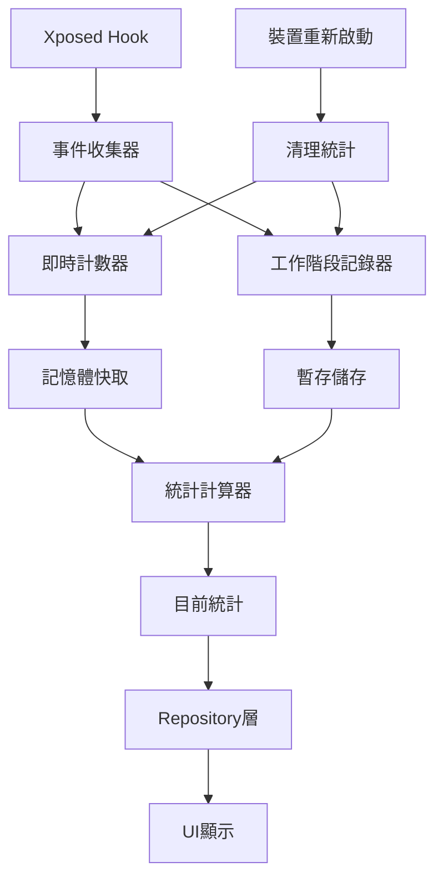

# 計數器系統

NoWakeLock 的計數器系統負責即時統計目前工作階段的 WakeLock、Alarm 和 Service 活動資料，為使用者提供目前的使用狀況和效能指標。系統採用工作階段層級的統計，裝置重新啟動後會重新開始計數。

## 計數器架構

### 系統概覽


### 核心元件
```kotlin
// 事件收集器介面
interface EventCollector {
    fun recordEvent(event: SystemEvent)
    fun getCurrentStats(): CurrentSessionStats
    fun resetStats() // 重新啟動後清理
}

// 計數器管理器
class CounterManager(
    private val realtimeCounter: RealtimeCounter,
    private val sessionRecorder: SessionRecorder,
    private val statisticsCalculator: StatisticsCalculator
) : EventCollector {
    
    override fun recordEvent(event: SystemEvent) {
        // 即時計數
        realtimeCounter.increment(event)
        
        // 工作階段記錄（重新啟動後清理）
        sessionRecorder.store(event)
        
        // 觸發統計更新
        if (shouldUpdateStatistics(event)) {
            statisticsCalculator.recalculate(event.packageName)
        }
    }
    
    override fun resetStats() {
        // BootResetManager 檢測重新啟動後呼叫
        realtimeCounter.clear()
        sessionRecorder.clear()
    }
}
```

## 即時計數器

### RealtimeCounter 實作
```kotlin
class RealtimeCounter {
    
    // 使用執行緒安全的資料結構
    private val wakelockCounters = ConcurrentHashMap<String, AtomicCounterData>()
    private val alarmCounters = ConcurrentHashMap<String, AtomicCounterData>()
    private val serviceCounters = ConcurrentHashMap<String, AtomicCounterData>()
    
    // 活動狀態追蹤
    private val activeWakelocks = ConcurrentHashMap<String, WakelockSession>()
    private val activeServices = ConcurrentHashMap<String, ServiceSession>()
    
    fun increment(event: SystemEvent) {
        when (event.type) {
            EventType.WAKELOCK_ACQUIRE -> handleWakelockAcquire(event)
            EventType.WAKELOCK_RELEASE -> handleWakelockRelease(event)
            EventType.ALARM_TRIGGER -> handleAlarmTrigger(event)
            EventType.SERVICE_START -> handleServiceStart(event)
            EventType.SERVICE_STOP -> handleServiceStop(event)
        }
    }
    
    private fun handleWakelockAcquire(event: SystemEvent) {
        val key = "${event.packageName}:${event.name}"
        
        // 增加取得計數
        wakelockCounters.computeIfAbsent(key) { 
            AtomicCounterData() 
        }.acquireCount.incrementAndGet()
        
        // 記錄活動狀態
        activeWakelocks[event.instanceId] = WakelockSession(
            packageName = event.packageName,
            tag = event.name,
            startTime = event.timestamp,
            flags = event.flags
        )
        
        // 更新應用程式層級統計
        updateAppLevelStats(event.packageName, EventType.WAKELOCK_ACQUIRE)
    }
    
    private fun handleWakelockRelease(event: SystemEvent) {
        val session = activeWakelocks.remove(event.instanceId) ?: return
        val key = "${session.packageName}:${session.tag}"
        
        val duration = event.timestamp - session.startTime
        
        wakelockCounters[key]?.let { counter ->
            // 更新持有時長
            counter.totalDuration.addAndGet(duration)
            counter.releaseCount.incrementAndGet()
            
            // 更新最大持有時長
            counter.updateMaxDuration(duration)
        }
        
        // 更新應用程式層級統計
        updateAppLevelStats(session.packageName, EventType.WAKELOCK_RELEASE, duration)
    }
    
    private fun handleAlarmTrigger(event: SystemEvent) {
        val key = "${event.packageName}:${event.name}"
        
        alarmCounters.computeIfAbsent(key) {
            AtomicCounterData()
        }.let { counter ->
            counter.triggerCount.incrementAndGet()
            counter.lastTriggerTime.set(event.timestamp)
            
            // 計算觸發間隔
            val interval = event.timestamp - counter.previousTriggerTime.getAndSet(event.timestamp)
            if (interval > 0) {
                counter.updateTriggerInterval(interval)
            }
        }
        
        updateAppLevelStats(event.packageName, EventType.ALARM_TRIGGER)
    }
}

// 原子計數器資料
class AtomicCounterData {
    // WakeLock 計數器
    val acquireCount = AtomicLong(0)
    val releaseCount = AtomicLong(0)
    val totalDuration = AtomicLong(0)
    val maxDuration = AtomicLong(0)
    
    // Alarm 計數器
    val triggerCount = AtomicLong(0)
    val lastTriggerTime = AtomicLong(0)
    val previousTriggerTime = AtomicLong(0)
    val minInterval = AtomicLong(Long.MAX_VALUE)
    val maxInterval = AtomicLong(0)
    val totalInterval = AtomicLong(0)
    
    // Service 計數器
    val startCount = AtomicLong(0)
    val stopCount = AtomicLong(0)
    val runningDuration = AtomicLong(0)
    
    // 通用方法
    fun updateMaxDuration(duration: Long) {
        maxDuration.accumulateAndGet(duration) { current, new -> maxOf(current, new) }
    }
    
    fun updateTriggerInterval(interval: Long) {
        minInterval.accumulateAndGet(interval) { current, new -> minOf(current, new) }
        maxInterval.accumulateAndGet(interval) { current, new -> maxOf(current, new) }
        totalInterval.addAndGet(interval)
    }
    
    fun snapshot(): CounterSnapshot {
        return CounterSnapshot(
            acquireCount = acquireCount.get(),
            releaseCount = releaseCount.get(),
            totalDuration = totalDuration.get(),
            maxDuration = maxDuration.get(),
            triggerCount = triggerCount.get(),
            avgInterval = if (triggerCount.get() > 1) {
                totalInterval.get() / (triggerCount.get() - 1)
            } else 0,
            minInterval = if (minInterval.get() == Long.MAX_VALUE) 0 else minInterval.get(),
            maxInterval = maxInterval.get()
        )
    }
}
```

### 工作階段追蹤
```kotlin
// WakeLock 工作階段資料
data class WakelockSession(
    val packageName: String,
    val tag: String,
    val startTime: Long,
    val flags: Int,
    val uid: Int = 0,
    val pid: Int = 0
) {
    val duration: Long get() = System.currentTimeMillis() - startTime
    val isLongRunning: Boolean get() = duration > 60_000 // 超過1分鐘
}

// Service 工作階段資料
data class ServiceSession(
    val packageName: String,
    val serviceName: String,
    val startTime: Long,
    val isForeground: Boolean = false,
    val instanceCount: Int = 1
) {
    val duration: Long get() = System.currentTimeMillis() - startTime
    val isLongRunning: Boolean get() = duration > 300_000 // 超過5分鐘
}

// 工作階段管理器
class SessionManager {
    
    private val activeWakelocks = ConcurrentHashMap<String, WakelockSession>()
    private val activeServices = ConcurrentHashMap<String, ServiceSession>()
    private val sessionHistory = LRUCache<String, List<SessionRecord>>(1000)
    
    fun startWakelockSession(instanceId: String, session: WakelockSession) {
        activeWakelocks[instanceId] = session
        scheduleSessionTimeout(instanceId, session.tag, 300_000) // 5分鐘逾時
    }
    
    fun endWakelockSession(instanceId: String): WakelockSession? {
        val session = activeWakelocks.remove(instanceId)
        session?.let {
            recordSessionHistory(it)
            cancelSessionTimeout(instanceId)
        }
        return session
    }
    
    fun getActiveSessions(): SessionSummary {
        return SessionSummary(
            activeWakelocks = activeWakelocks.values.toList(),
            activeServices = activeServices.values.toList(),
            totalActiveTime = calculateTotalActiveTime(),
            longestRunningSession = findLongestRunningSession()
        )
    }
    
    private fun scheduleSessionTimeout(instanceId: String, tag: String, timeout: Long) {
        // 使用協程延遲處理逾時工作階段
        CoroutineScope(Dispatchers.IO).launch {
            delay(timeout)
            if (activeWakelocks.containsKey(instanceId)) {
                XposedBridge.log("WakeLock timeout: $tag (${timeout}ms)")
                // 強制釋放逾時的 WakeLock
                forceReleaseWakeLock(instanceId)
            }
        }
    }
}
```

## 工作階段記錄器

### SessionRecorder 實作
```kotlin
class SessionRecorder(
    private val database: InfoDatabase
) {
    
    private val eventBuffer = ConcurrentLinkedQueue<InfoEvent>()
    private val bufferSize = AtomicInteger(0)
    private val maxBufferSize = 1000
    
    fun store(event: SystemEvent) {
        val infoEvent = event.toInfoEvent()
        
        // 新增到緩衝區（僅目前工作階段）
        eventBuffer.offer(infoEvent)
        
        // 檢查是否需要批次寫入
        if (bufferSize.incrementAndGet() >= maxBufferSize) {
            flushBuffer()
        }
    }
    
    private fun flushBuffer() {
        val events = mutableListOf<InfoEvent>()
        
        // 批次取出事件
        while (events.size < maxBufferSize && !eventBuffer.isEmpty()) {
            eventBuffer.poll()?.let { events.add(it) }
        }
        
        if (events.isNotEmpty()) {
            CoroutineScope(Dispatchers.IO).launch {
                try {
                    // 注意：InfoDatabase 在初始化時會 clearAllTables()
                    // 重新啟動後資料會被 BootResetManager 清理
                    database.infoEventDao().insertAll(events)
                    bufferSize.addAndGet(-events.size)
                } catch (e: Exception) {
                    XposedBridge.log("Failed to store session events: ${e.message}")
                    // 重新加入佇列重試
                    events.forEach { eventBuffer.offer(it) }
                }
            }
        }
    }
    
    fun getCurrentSessionStats(
        packageName: String?,
        type: EventType?
    ): CurrentSessionStats {
        return runBlocking {
            // 只查詢目前工作階段資料（重新啟動後清空）
            val events = database.infoEventDao().getCurrentSessionEvents(
                packageName = packageName,
                type = type?.toInfoEventType()
            )
            
            calculateCurrentSessionStats(events)
        }
    }
    
    fun clear() {
        // 重新啟動後清理資料
        eventBuffer.clear()
        bufferSize.set(0)
    }
}

// 重新啟動檢測管理器
class BootResetManager(
    private val database: InfoDatabase,
    private val realtimeCounter: RealtimeCounter
) {
    
    fun checkAndResetAfterBoot(): Boolean {
        val bootTime = SystemClock.elapsedRealtime()
        val lastBootTime = getLastBootTime()
        
        // 檢測是否重新啟動
        val isAfterReboot = bootTime < lastBootTime || lastBootTime == 0L
        
        if (isAfterReboot) {
            // 清理所有統計資料
            resetAllStatistics()
            saveLastBootTime(bootTime)
            XposedBridge.log("Device rebooted, statistics reset")
            return true
        }
        
        return false
    }
    
    private fun resetAllStatistics() {
        // 清理資料庫表（InfoDatabase 本身在初始化時也會清理）
        database.infoEventDao().clearAll()
        database.infoDao().clearAll()
        
        // 清理記憶體計數器
        realtimeCounter.clear()
    }
}
```

## 統計計算器

### StatisticsCalculator 實作
```kotlin
class StatisticsCalculator(
    private val realtimeCounter: RealtimeCounter,
    private val sessionRecorder: SessionRecorder,
    private val database: InfoDatabase
) {
    
    fun calculateCurrentAppStatistics(packageName: String): CurrentAppStatistics {
        val realtimeStats = realtimeCounter.getAppStats(packageName)
        val sessionStats = sessionRecorder.getCurrentSessionStats(packageName, null)
        
        return CurrentAppStatistics(
            packageName = packageName,
            sessionStartTime = getSessionStartTime(),
            wakelockStats = calculateCurrentWakelockStats(packageName),
            alarmStats = calculateCurrentAlarmStats(packageName),
            serviceStats = calculateCurrentServiceStats(packageName),
            currentMetrics = calculateCurrentMetrics(packageName)
        )
    }
    
    private fun calculateCurrentWakelockStats(packageName: String): CurrentWakelockStats {
        val events = runBlocking {
            // 只查詢目前工作階段資料（重新啟動後已清空）
            database.infoEventDao().getCurrentSessionWakelockEvents(packageName)
        }
        
        val activeEvents = events.filter { it.endTime == null }
        val completedEvents = events.filter { it.endTime != null }
        
        return CurrentWakelockStats(
            totalAcquires = events.size,
            totalReleases = completedEvents.size,
            currentlyActive = activeEvents.size,
            totalDuration = completedEvents.sumOf { it.duration },
            averageDuration = if (completedEvents.isNotEmpty()) {
                completedEvents.map { it.duration }.average().toLong()
            } else 0,
            maxDuration = completedEvents.maxOfOrNull { it.duration } ?: 0,
            blockedCount = events.count { it.isBlocked },
            blockRate = if (events.isNotEmpty()) {
                events.count { it.isBlocked }.toFloat() / events.size
            } else 0f,
            topTags = calculateTopWakelockTags(events),
            recentActivity = calculateRecentActivity(events)
        )
    }
    
    private fun calculateCurrentAlarmStats(packageName: String): CurrentAlarmStats {
        val events = runBlocking {
            database.infoEventDao().getCurrentSessionAlarmEvents(packageName)
        }
        
        val triggerIntervals = calculateTriggerIntervals(events)
        
        return CurrentAlarmStats(
            totalTriggers = events.size,
            blockedTriggers = events.count { it.isBlocked },
            blockRate = if (events.isNotEmpty()) {
                events.count { it.isBlocked }.toFloat() / events.size
            } else 0f,
            averageInterval = triggerIntervals.average().toLong(),
            recentTriggers = events.takeLast(10), // 最近10次觸發
            topTags = calculateTopAlarmTags(events)
        )
    }
    
    private fun calculatePerformanceMetrics(packageName: String, timeRange: TimeRange): PerformanceMetrics {
        val events = runBlocking {
            database.infoEventDao().getEventsByPackage(
                packageName = packageName,
                startTime = timeRange.startTime,
                endTime = timeRange.endTime
            )
        }
        
        return PerformanceMetrics(
            totalEvents = events.size,
            eventsPerHour = calculateEventsPerHour(events, timeRange),
            averageCpuUsage = events.map { it.cpuUsage }.average().toFloat(),
            averageMemoryUsage = events.map { it.memoryUsage }.average().toLong(),
            totalBatteryDrain = events.sumOf { it.batteryDrain.toDouble() }.toFloat(),
            efficiencyRating = calculateOverallEfficiency(events),
            resourceIntensity = calculateResourceIntensity(events),
            backgroundActivityRatio = calculateBackgroundRatio(events)
        )
    }
}

// 統計資料類（目前工作階段）
data class CurrentAppStatistics(
    val packageName: String,
    val sessionStartTime: Long, // 目前工作階段開始時間（重新啟動後重設）
    val wakelockStats: CurrentWakelockStats,
    val alarmStats: CurrentAlarmStats,
    val serviceStats: CurrentServiceStats,
    val currentMetrics: CurrentMetrics
)

data class CurrentWakelockStats(
    val totalAcquires: Int,
    val totalReleases: Int,
    val currentlyActive: Int,
    val totalDuration: Long,
    val averageDuration: Long,
    val maxDuration: Long,
    val blockedCount: Int,
    val blockRate: Float,
    val topTags: List<TagCount>,
    val recentActivity: List<RecentEvent> // 最近活動，不是歷史趨勢
)

data class CurrentAlarmStats(
    val totalTriggers: Int,
    val blockedTriggers: Int,
    val blockRate: Float,
    val averageInterval: Long,
    val recentTriggers: List<InfoEvent>, // 最近觸發記錄
    val topTags: List<TagCount>
)

data class CurrentServiceStats(
    val totalStarts: Int,
    val currentlyRunning: Int,
    val averageRuntime: Long,
    val blockedStarts: Int,
    val blockRate: Float,
    val topServices: List<ServiceCount>
)

data class CurrentMetrics(
    val totalEvents: Int,
    val eventsPerHour: Double, // 目前工作階段的事件頻率
    val sessionDuration: Long, // 工作階段持續時間
    val averageResponseTime: Long, // 平均回應時間
    val systemLoad: Float // 系統負載指標
)

data class RecentEvent(
    val timestamp: Long,
    val name: String,
    val action: String, // acquire/release/block
    val duration: Long?
)

data class TagCount(
    val tag: String,
    val count: Int,
    val percentage: Float
)

data class ServiceCount(
    val serviceName: String,
    val startCount: Int,
    val runningTime: Long
)
```

## 資料清理機制

### 重新啟動檢測和清理
```kotlin
// 實際程式碼中的 BootResetManager 實作
class BootResetManager(
    private val context: Context,
    private val userPreferencesRepository: UserPreferencesRepository
) {
    
    suspend fun checkAndResetIfNeeded(): Boolean {
        val currentBootTime = SystemClock.elapsedRealtime()
        val lastRecordedTime = userPreferencesRepository.getLastBootTime().first()
        val resetDone = userPreferencesRepository.getResetDone().first()
        
        // 檢測是否重新啟動：目前執行時間 < 上次記錄的時間
        val isAfterReboot = currentBootTime < lastRecordedTime || lastRecordedTime == 0L
        
        if (isAfterReboot || !resetDone) {
            resetTables() // 清理資料庫表
            userPreferencesRepository.setLastBootTime(currentBootTime)
            userPreferencesRepository.setResetDone(true)
            return true
        }
        return false
    }
    
    private suspend fun resetTables() {
        val db = AppDatabase.getInstance(context)
        // 清空統計表和事件表
        db.infoDao().clearAll()
        db.infoEventDao().clearAll()
    }
}

// XProvider 中的自動清理
class XProvider {
    companion object {
        private var db: InfoDatabase = InfoDatabase.getInstance(context).also { 
            it.clearAllTables() // 每次初始化都清空
        }
    }
}
```

### 為什麼要清理歷史資料

**設計理念**：
- **即時管控不需要歷史資料** - WakeLock/Alarm 的攔截決策是即時的
- **統計顯示目前工作階段** - 使用者關心的是目前電池消耗情況
- **避免資料積累** - 歷史 WakeLock 事件對系統沒有價值
- **保持系統清潔** - 重新啟動後重新開始更反映實際使用情況

## 效能最佳化

### 快取策略
```kotlin
class SessionStatisticsCache {
    
    private val cache = LRUCache<String, CacheEntry>(50) // 減少快取大小
    private val cacheExpiry = 60_000L // 1分鐘過期（短期快取）
    
    fun getCurrentAppStatistics(packageName: String): CurrentAppStatistics? {
        val key = "current_${packageName}"
        val entry = cache.get(key)
        
        return if (entry != null && !entry.isExpired()) {
            entry.statistics
        } else {
            null
        }
    }
    
    fun putCurrentAppStatistics(packageName: String, statistics: CurrentAppStatistics) {
        val key = "current_${packageName}"
        cache.put(key, CacheEntry(statistics, System.currentTimeMillis() + cacheExpiry))
    }
    
    fun clearOnReboot() {
        // 重新啟動後清理所有快取
        cache.evictAll()
    }
    
    private data class CacheEntry(
        val statistics: CurrentAppStatistics,
        val expiryTime: Long
    ) {
        fun isExpired(): Boolean = System.currentTimeMillis() > expiryTime
    }
}

// 輕量級計算管理器
class LightweightStatsManager(
    private val realtimeCounter: RealtimeCounter,
    private val cache: SessionStatisticsCache
) {
    
    // 只計算必要的即時資料
    fun getQuickStats(packageName: String): QuickStats {
        val cached = cache.getCurrentAppStatistics(packageName)
        if (cached != null) return cached.toQuickStats()
        
        // 輕量級計算
        val realtime = realtimeCounter.getAppStats(packageName)
        return QuickStats(
            activeWakelocks = realtime.activeWakelocks,
            totalEvents = realtime.totalEvents,
            blockedEvents = realtime.blockedEvents,
            sessionUptime = System.currentTimeMillis() - getSessionStartTime()
        )
    }
}

data class QuickStats(
    val activeWakelocks: Int,
    val totalEvents: Int,
    val blockedEvents: Int,
    val sessionUptime: Long
)
```

!!! info "計數器設計原則"
    NoWakeLock 的計數器系統採用工作階段層級設計，為 Xposed 模組的即時管控功能而最佳化。重點在於目前狀態的即時顯示，而非長期資料分析。

!!! tip "為什麼不儲存歷史資料"
    - **即時管控不需要歷史資料**：WakeLock/Alarm 的攔截決策基於目前事件和規則
    - **統計只需目前工作階段**：使用者關心的是目前電池消耗和系統狀態
    - **防止資料積累**：歷史 WakeLock 事件對系統管理沒有實際價值
    - **保持系統輕量**：重新啟動清理資料確保模組高效執行

!!! warning "資料生命週期"
    - **即時計數器**：記憶體中儲存，程序重新啟動清空
    - **工作階段記錄器**：資料庫暫存儲存，裝置重新啟動清空
    - **統計資料**：只存在於目前工作階段，不跨重新啟動儲存