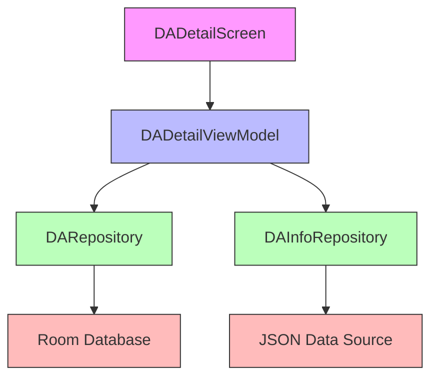

# Architecture: WakeLock Detail Screen
*Created: 2023-08-05*
*Updated: 2023-08-05*

## Technology Stack
- **Language**: Kotlin
- **Frontend**: Jetpack Compose
- **Architecture**: MVVM with Repository pattern
- **State Management**: StateFlow and immutable state
- **UI Design**: Material Design 3
- **Database**: Room Database (existing)
- **Data Formats**: JSON for description information

## System Components

## Component Details
### DADetailScreen
- **Purpose**: Display detailed information about a Device Automation item
- **Key features**: 
  - Header with item information
  - Statistics card
  - Information card with description and recommendations
  - Settings card with interactive controls
  - Timeline chart showing 24-hour activity
  - Recent activity list
- **Technologies**: Jetpack Compose, Material 3, Canvas for charts

### DADetailViewModel
- **Purpose**: Manage UI state and data operations
- **Key features**:
  - Load item data and details
  - Calculate statistics
  - Generate timeline data
  - Update settings
- **Technologies**: ViewModel, StateFlow, Coroutines

### DAInfoRepository
- **Purpose**: Retrieve detailed information about DA items
- **Key features**:
  - Load JSON information
  - Match items by ID and package
  - Provide descriptions and recommendations
- **Technologies**: Gson, Coroutines, IO operations

## Data Flow
1. UI requests data by calling `loadDADetail()` with item identifiers
2. ViewModel fetches basic information from DARepository
3. ViewModel fetches descriptive information from DAInfoRepository
4. ViewModel transforms InfoEvent records into timeline and activity data
5. ViewModel calculates statistics and updates UI state
6. UI observes state and renders components
7. User interactions with settings are sent to ViewModel
8. ViewModel updates database through DARepository

## Key Technical Decisions
- **Repository Pattern**: Following existing codebase structure for data access
- **Single JSON File**: Using a single JSON file for description information instead of database tables
- **Canvas for Timeline**: Using Canvas for custom timeline chart rendering
- **Flow-based State**: Using StateFlow for reactive UI updates
- **Immutable UI State**: Ensuring thread-safety and predictable state changes

## Security Considerations
- JSON file validation before parsing
- Input validation for settings values
- Error handling for data loading and processing

---

*This document captures technical decisions and system structure.*