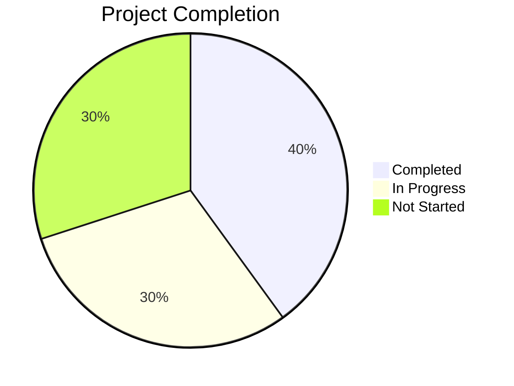

# Progress: WakeLock Detail Screen Implementation
*Created: 2023-08-05*
*Updated: 2023-08-05*

## Project Status

## Current Focus
Design and implementation planning for the DADetailScreen and related components. Building the core data structures and repositories needed for the implementation.

## Recently Completed
- ✅ Analysis of existing codebase structure - 2023-08-05
- ✅ Data model design (DAInfoEntry, DADetailState) - 2023-08-05
- ✅ Repository interface definition (DAInfoRepository) - 2023-08-05
- ✅ UI component structure planning - 2023-08-05
- ✅ Navigation requirements identification - 2023-08-05

## In Progress
- 🔄 DAInfoRepository implementation - 50% - Working on JSON loading mechanism
- 🔄 DADetailViewModel design - 70% - Finalizing data loading and transformation methods
- 🔄 UI component structure - 40% - Mapping out how components will be organized

## Up Next
- ⏳ Implementation of the DADetailScreen - Priority: High
- ⏳ Canvas-based Timeline chart - Priority: Medium
- ⏳ Settings management implementation - Priority: High
- ⏳ Integration with navigation system - Priority: Medium

## Issues
- 🟡 TopAppBar integration requirements - Need to ensure proper navigation title display - Under review
- 🟢 Timeline visualization performance - Need to optimize Canvas rendering - Planned

## Milestones
- 🏁 Core data structures defined - 2023-08-05 - Completed
- 🏁 Basic UI structure implemented - 2023-08-10 - Planned
- 🏁 Interactive features working - 2023-08-15 - Planned
- 🏁 Complete screen with all features - 2023-08-30 - Planned

## Implementation Checklist Progress
- [x] Define data models
- [x] Design DAInfoRepository interface
- [x] Plan ViewModel structure
- [ ] Implement DAInfoRepository
- [ ] Implement DADetailViewModel
- [ ] Create UI components
- [ ] Implement timeline visualization
- [ ] Integrate with navigation
- [ ] Implement settings management
- [ ] Testing and refinement

---

*This document tracks development progress and task status.*