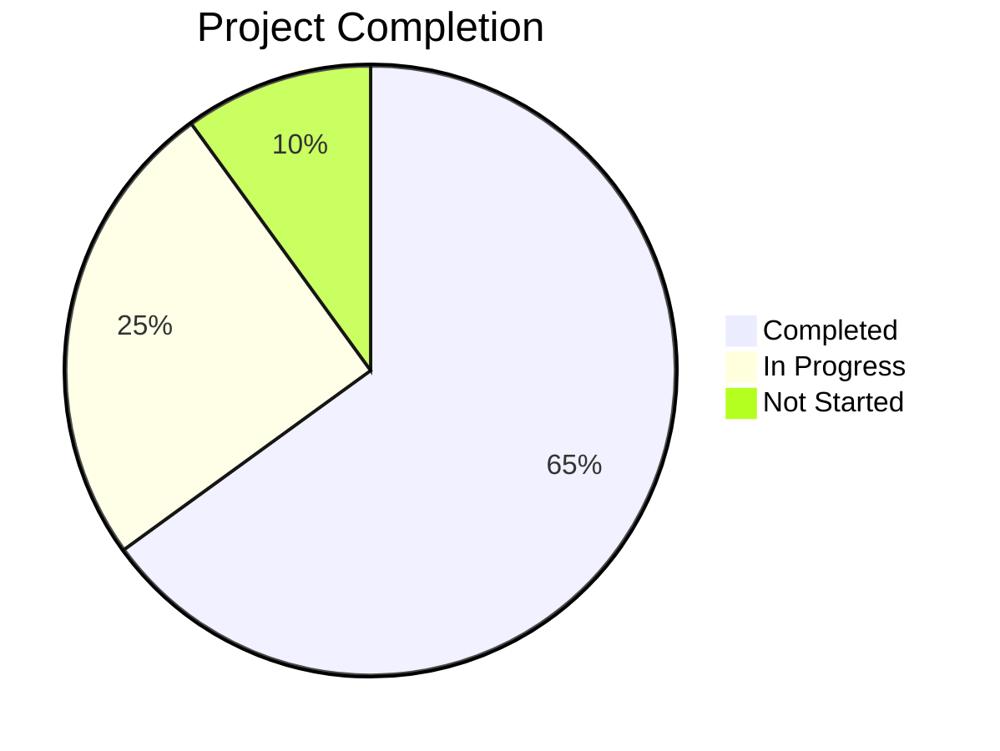

# σ₅: Progress Tracker
*v1.3 | Created: 2025-04-09 | Updated: 2025-04-12*
*Π: INITIALIZING | Ω: EXECUTE*

## 📈 Project Status
Completion: 65%

## ✅ 已完成功能
- [F₁] [✅] Core XPosed Module - 基本的闹钟、唤醒锁和服务拦截功能
- [F₂] [✅] 数据存储系统 - Room 数据库实现
- [F₃] [✅] 应用列表功能 - 扫描并显示已安装应用程序
- [F₄] [✅] 基本主题支持 - Material 3 主题
- [F₅] [✅] 搜索状态管理 - 屏幕切换时重置搜索状态
- [F₆] [✅] 唤醒锁类型UI - 条件显示AccessTime Surface
- [F₇] [✅] 详情页导航 - 从列表项导航到详情页面

## ⏳ 进行中的功能
- [F₈] [⏳75%] Compose UI 重构 - 从旧版 XML 布局迁移到 Jetpack Compose
- [F₉] [⏳60%] 依赖注入配置 - 优化 Koin 依赖注入
- [F₁₀] [⏳50%] 多用户支持 - 对多用户环境下的操作支持
- [F₁₁] [⏳40%] 数据备份与恢复 - 用户配置的导入导出功能

## 🔜 待实现功能
- [F₁₂] [🔜] [HIGH] 应用统计 - 详细的唤醒和闹钟统计数据
- [F₁₃] [🔜] [MED] 自定义规则创建 - 高级用户的自定义规则
- [F₁₄] [🔜] [LOW] 实时监控 - 系统唤醒事件的实时监控界面
- [F₁₅] [🔜] [LOW] 导航动画 - 增强页面切换的视觉体验

## ⚠️ 已知问题
- [I₁] [⚠️] [HIGH] 在部分设备上 Xposed 钩子不稳定
- [I₂] [⚠️] [MED] Koin 依赖注入配置错误 - by inject() 缺少类型参数
- [I₃] [⚠️] [MED] Compose 导航有时会出现重复导航问题
- [I₄] [⚠️] [LOW] 用户界面在某些尺寸设备上显示不正确

## 🏁 里程碑
- [M₁] [2025-04-30] [⏳] 完成所有 Compose UI 迁移
- [M₂] [2025-05-15] [🔜] 数据备份与恢复完整实现
- [M₃] [2025-06-01] [🔜] 完成应用统计功能
- [M₄] [2025-06-15] [🔜] Beta 版本发布

---
σ₅ tracks project progress and outstanding work
