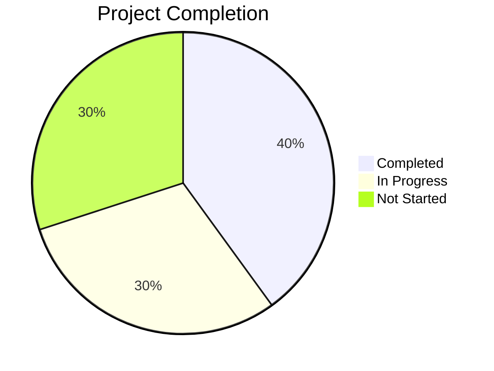

# Progress: WakeLock Detail Screen Implementation
*Updated: 2025-04-10*

## Project Status

## Current Focus
Implementing the DARepository interface methods that are needed for the DADetailViewModel.

## Recently Completed
- ✅ Analyzed the current code structure and dependencies
- ✅ Identified missing repository methods needed for DADetailViewModel
- ✅ Defined interface for DARepository with required methods
- ✅ Implemented DARepositoryImpl with necessary methods for data access
- ✅ Defined needed DAO interfaces for database access

## In Progress
- 🔄 Completing the integration with existing data access layers
- 🔄 Testing the repository implementation with the ViewModel

## Up Next
- ⏳ Complete the UI implementation for the detail screen
- ⏳ Connect the ViewModel with the UI components
- ⏳ Test the full implementation

## Issues
- 🟡 Need to verify if the InfoEventDao and StDao implementations match the actual database schema
- 🟡 May need to adjust the query methods based on actual data access patterns

## Milestones
- 🏁 Core data structures defined - 2023-08-05 - Completed
- 🏁 Basic UI structure implemented - 2023-08-10 - Planned
- 🏁 Interactive features working - 2023-08-15 - Planned
- 🏁 Complete screen with all features - 2023-08-30 - Planned

## Implementation Checklist Progress
- [x] Define data models
- [x] Design DAInfoRepository interface
- [x] Plan ViewModel structure
- [ ] Implement DAInfoRepository
- [ ] Implement DADetailViewModel
- [ ] Create UI components
- [ ] Implement timeline visualization
- [ ] Integrate with navigation
- [ ] Implement settings management
- [ ] Testing and refinement

---

*This document tracks development progress and task status.*