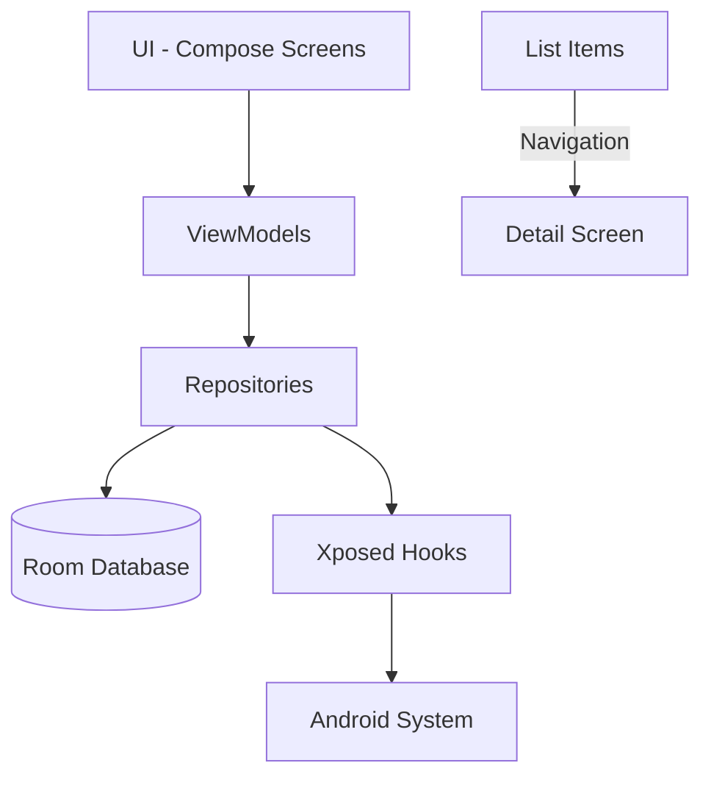

# σ₂: System Patterns
*v1.2 | Created: 2025-04-09 | Updated: 2025-04-12*
*Π: INITIALIZING | Ω: EXECUTE*

## 🏛️ Architecture Overview
NoWakeLock 遵循清晰的架构方法，使用 MVVM（Model-View-ViewModel）模式和 Jetpack Compose 构建 UI 层。应用由两个主要组件组成：与 Android 系统交互的 Xposed 模块钩子，以及用于配置和监控的用户界面应用。现在已添加详情页面导航功能，使用户可以查看设备自动化项目的详细信息。



## 🧩 Key Components
- [K₁] UI Layer: Material 3 Compose 屏幕用于用户交互
- [K₂] ViewModel Layer: 管理 UI 状态和业务逻辑
- [K₃] Repository Layer: 数据访问和操作
- [K₄] Database Layer: Room 持久化存储
- [K₅] Xposed Hooks: 系统级拦截和控制
- [K₆] DI Framework: Koin 依赖注入
- [K₇] Navigation: Jetpack Navigation Compose 控制应用导航

## 🧪 Design Patterns
- [P₁] MVVM: 分离 UI、业务逻辑和数据
- [P₂] Repository: 数据源抽象
- [P₃] Dependency Injection: Koin 构造函数注入
- [P₄] Observer Pattern: LiveData 和 StateFlow 用于 UI 更新
- [P₅] Factory Pattern: 用于创建数据对象
- [P₆] Navigation Pattern: 基于路由的导航模式

## 🔄 Data Flow
应用使用单向数据流模式，UI 事件触发 ViewModel 操作，ViewModel 通过 StateFlow 更新 UI 状态。导航事件遵循相同模式，从列表项触发到导航控制器。
```
flowchart LR
    User[User] --> UI[Compose UI]
    UI --> Events[UI Events]
    Events --> ViewModel[ViewModel]
    Events --> NavEvents[Navigation Events]
    NavEvents --> NavController[Navigation Controller]
    ViewModel --> Repos[Repositories]
    Repos --> DB[(Room Database)]
    Repos --> XP[Xposed Module]
    ViewModel --> State[UI State]
    State --> UI
    NavController --> Destination[Screen Destination]
```

## 🔍 Technical Decisions
- [D₁] Jetpack Compose: 现代 UI 工具包，提供更好的用户体验
- [D₂] Material 3: 来自 Google 的最新设计系统
- [D₃] Koin DI: Dagger/Hilt 的轻量级替代方案
- [D₄] Room DB: 类型安全的数据库访问，支持 SQL
- [D₅] Kotlin Coroutines: 用于异步操作和并发
- [D₆] Navigation Compose: 用于应用内导航的现代 API

## 🔗 Component Relationships
应用按功能区域（闹钟、唤醒锁、服务、应用）组织成逻辑模块。每个模块包含自己的屏幕、ViewModels 和 repositories，共享一个通用核心架构。详情页面展示特定项目的深入信息，使用导航参数传递最少必要信息。

---
σ₂ captures system architecture and design patterns